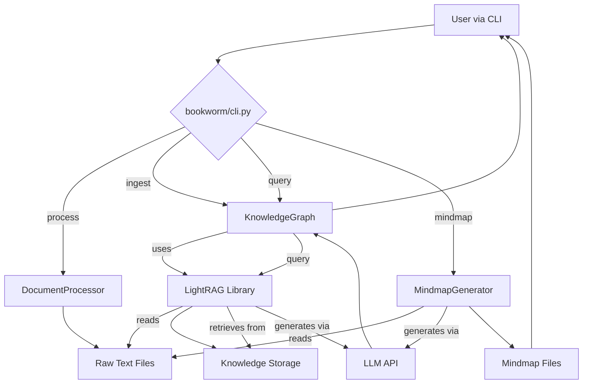

# BookWorm 系统架构与模块设计

## 1. BookWorm 模块文件结构

### 1.1 文件组织

根据项目 `README.md` 的描述，BookWorm 项目遵循标准的Python包结构。

```
BookWorm/
├── bookworm/                 # 主功能包
│   ├── __init__.py
│   ├── core.py              # 核心组件 (DocumentProcessor, KnowledgeGraph)
│   ├── utils.py             # 工具函数 (配置加载, 日志)
│   ├── cli.py               # 命令行接口定义
│   └── mindmap_generator.py # 高级思维导图生成器
├── tests/                   # 测试套件
├── examples/                # 示例脚本和文件
├── docs/                    # 项目文档
├── main.py                  # 命令行程序入口 (uv run bookworm ...)
├── pyproject.toml           # 项目依赖与配置 (uv, ruff, black)
└── .env.example             # 环境变量模板
```

### 1.2 模块职责划分

- **main.py**: 项目的主入口脚本，用于启动 `typer` 定义的命令行应用。
- **bookworm/cli.py**: 使用 `typer` 库定义所有用户可见的命令，如 `process`, `ingest`, `query`, `mindmap`，并协调核心模块完成任务。
- **bookworm/core.py**: 包含系统的核心业务逻辑，主要实现了 `DocumentProcessor` (文档处理) 和 `KnowledgeGraph` (知识图谱管理) 两个关键类。
- **bookworm/mindmap_generator.py**: 封装了与大语言模型（LLM）交互的逻辑，专门用于从文本内容生成层级化的思维导图。
- **bookworm/utils.py**: 提供全局的辅助功能，如通过 `dotenv` 加载 `.env` 文件中的配置、初始化日志系统等。

## 2. BookWorm 模块设计

### 2.1 文档处理器 (DocumentProcessor in `core.py`)

- **核心职责**: 负责从多种格式的源文件中安全、高效地提取纯文本内容和元数据。
- **主要功能**:
    - 支持PDF, DOCX, TXT, Markdown等多种文件格式。
    - 提供 `process_document` 和 `process_directory` 方法，支持单个文件和整个目录的批量处理。
    - 利用并发处理（concurrent processing）来提高处理大量文件时的效率。
    - 自动提取文件名、大小、创建日期等元数据。

### 2.2 知识图谱管理器 (KnowledgeGraph in `core.py`)

- **核心职责**: 管理知识的摄入、存储和查询。它是 `LightRAG` 库的直接封装和应用层。
- **主要功能**:
    - **摄入 (`ingest`)**: 接收 `DocumentProcessor` 提取的文本，调用 `LightRAG` 服务进行知识提取（实体、关系），并构建知识图谱和向量索引。
    - **查询 (`query`)**: 接收用户问题，根据指定的模式（如 `hybrid`, `local`）在知识图谱和向量数据库中检索相关上下文，并调用LLM生成答案。
    - **持久化**: 将构建的知识图谱和索引数据保存在工作目录（`workspace/rag_storage/`）中，确保知识可以跨会话重用。

### 2.3 思维导图生成器 (MindmapGenerator in `mindmap_generator.py`)

- **核心职责**: 将非结构化的文档内容转化为结构化的思维导图。
- **主要功能**:
    - **分层分析**: 调用LLM对文本进行深层分析，提取核心主题、子主题和关键细节。
    - **多格式输出**: 支持将思维导图输出为 Mermaid 语法、可交互的 HTML 文件或 Markdown 大纲格式。
    - **LLM适配**: 能够根据配置（如 `API_PROVIDER`）切换使用不同的LLM（OpenAI, Claude, DeepSeek等）。

### 2.4 配置系统 (`utils.py` 和 `.env`)

- **核心职责**: 提供灵活、集中的配置管理方案。
- **配置结构**: 采用 `.env` 文件存储敏感信息和可变参数。
    - `LLM API Keys`: 如 `OPENAI_API_KEY`, `ANTHROPIC_API_KEY`。
    - `Primary LLM Provider`: `API_PROVIDER`，用于指定默认的LLM服务商。
    - `LightRAG Configuration`: `LLM_MODEL`, `EMBEDDING_MODEL`, `WORKING_DIR` 等 `LightRAG` 运行所需参数。
    - `Processing Settings`: `MAX_CONCURRENT_PROCESSES`, `PDF_PROCESSOR` 等文档处理相关配置。

## 3. BookWorm 数据流与模块交互

### 3.1 数据处理流程

1.  **输入**: 用户通过CLI提供一个包含多个文档的目录路径。
2.  **文本提取**: `DocumentProcessor` 遍历目录，并发地从每个文件中提取纯文本内容，保存到 `workspace/processed/`。
3.  **知识摄入**: `KnowledgeGraph` 读取处理后的文本，通过 `LightRAG` 进行分析，提取实体和关系，生成向量嵌入，并存入 `workspace/rag_storage/` 中的知识库（如图数据库和向量数据库）。
4.  **思维导图生成**: `MindmapGenerator` 读取原始文本，调用LLM生成结构化的思维导图，并保存到 `workspace/output/`。

### 3.2 查询流程

1.  **输入**: 用户通过CLI输入一个自然语言问题。
2.  **上下文检索**: `KnowledgeGraph` 对问题进行编码，在知识库中进行混合检索，找出最相关的文本片段、实体和关系作为上下文。
3.  **答案生成**: 将原始问题和检索到的上下文组合成一个提示（Prompt），发送给配置的LLM。
4.  **输出**: LLM生成答案，CLI将其展示给用户。

### 3.3 核心数据流

- **原始数据**: 各种格式的文档文件（`.pdf`, `.docx` 等）。
- **中间数据**: 纯文本文件（`.txt`），由 `DocumentProcessor` 生成。
- **结构化知识**: 知识图谱文件（GraphML）、向量索引（FAISS或Chroma）和键值存储（TinyDB），由 `LightRAG` 在 `rag_storage` 目录中管理。
- **最终输出**: 查询结果（文本）、思维导图（HTML, Mermaid语法等）。

### 3.4 模块交互图


