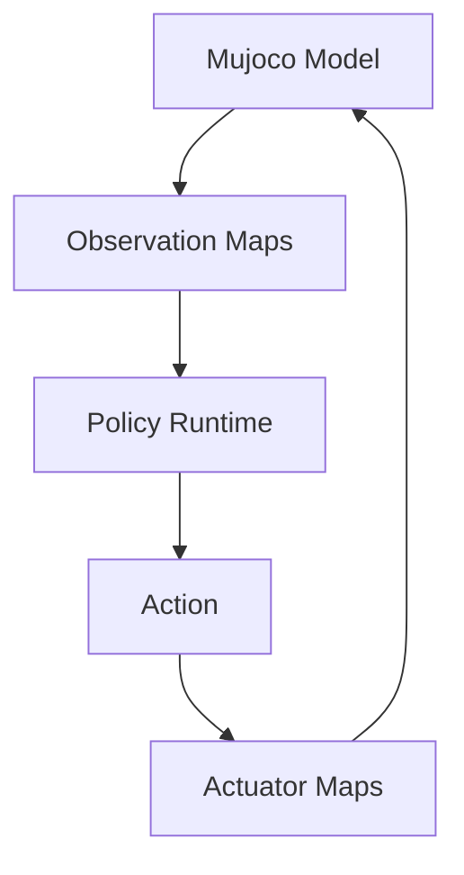

# Sim2SimLib
[](https://docs.isaacsim.omniverse.nvidia.com/latest/index.html)
[](https://docs.isaacsim.omniverse.nvidia.com/latest/index.html)
[](https://isaac-sim.github.io/IsaacLab)
[](https://isaac-sim.github.io/IsaacLab)
[](https://mujoco.org/)
[](https://www.python.org/downloads/)
[](https://pytorch.org/)

A high-performance simulation library designed for transferring policies from IsaacLab to MuJoCo simulation environments. This codebase provides a unified interface for robot simulation, motor modeling, and motion tracking.

## Snapshots

<!-- | Basic Velocity Task |
|----------| -->

| Go2 HandStand | G1 FlatVelocity |
|----------|------------|
| <video src="./docs/videos/Go2_HandStand.mp4" width="320" controls><a href="./docs/videos/Go2_HandStand.mp4">Video at here</a></video>  | <video src="./docs/videos/G1_29dof_Velocity.mp4" width="320" controls><a href="./docs/videos/G1_29dof_Velocity.mp4">Video at here</a></video> |


## Features
| Feature                | Description                                                                                   |
|------------------------|-----------------------------------------------------------------------------------------------|
| Policy Transfer        | Seamless transfer of trained policies from IsaacLab to MuJoCo                                 |
| Motor Models           | Realistic DC motor and PID motor models with velocity-dependent torque limits                 |
| Motion Tracking        | Advanced motion manager for kinematic tracking and motion playback                            |
| Observation History    | Support for temporal observation sequences with configurable history length                   |
| Flexible Configuration | Comprehensive configuration system for different robot platforms                              |

## Code Structure

```
sim2simlib/
├── model/
│   ├── sim2sim_base.py      # Base classes and core simulation logic
│   ├── sim2sim_motion.py    # Motion tracking and kinematic playback
│   ├── actuator_motor.py    # Motor models (PID, DC motor)
│   └── config.py            # Configuration dataclasses
├── motion/
│   └── motion_manager.py  # Motion manager system
├── utils/
│   └── utils.py           # Utility functions
└── scripts/               # Example scripts and demos
```

## Core Design

### Framework



### Base Architecture

The library follows a hierarchical design pattern:

- **`Sim2Sim` (Abstract Base Class)**: Defines the core interface with abstract methods for `act()`, `process_action()`, and `apply_action()`
- **`Sim2SimBaseModel`**: Implements basic policy-driven simulation with PID/DC motor control
- **`Sim2SimMotionModel`**: Extends base model with motion tracking capabilities

### Base Observation Input

The observation system supports both current and historical observations:

```python
# Current observations
base_observations = {
    "joint_pos": np.ndarray,      # Joint positions relative to initial pose
    "joint_vel": np.ndarray,      # Joint velocities  
    "base_lin_vel": np.ndarray,   # Base linear velocity
    "base_ang_vel": np.ndarray,   # Base angular velocity
    "gravity_orientation": np.ndarray,  # Gravity vector in base frame
    "cmd": np.ndarray,            # Command inputs
    "last_action": np.ndarray     # Previous action
}

# Historical observations (optional)
# Concatenated: [t-n, t-(n-1), ..., t-1, t] or stacked: (history_length, obs_dim)
```

### Motion Observation Input

Advanced motion tracking system for kinematic playback:

- **Motion Data Loading**: Support for various motion formats from TrackerLab
- **Finite State Machine**: Motion state management and transitions
- **Forward Kinematics**: Real-time motion visualization


### Motor Models

**PID Motor** - Simple PID controller with constant torque limits:
```
τ = K_p * (q_des - q) + K_d * (q̇_des - q̇) + τ_ff
τ_applied = clip(τ, -τ_max, τ_max)
```

**DC Motor** - Realistic DC motor model with velocity-dependent torque limits:
```
v_ratio = q̇ / q̇_max
τ_max(q̇) = τ_sat * (1 - |v_ratio|)
τ_min(q̇) = -τ_sat * (1 + |v_ratio|) 
τ_applied = clip(τ, τ_min_final, τ_max_final)
```

## Usage

### Basic Setup

1. **Define Robot Configuration**:

```python
from sim2simlib.model.config import *
from sim2simlib.model.actuator_motor import PIDMotor, DCMotor

# Motor configuration with regex patterns
motor_cfg = Motor_Config(
    motor_type=DCMotor,
    effort_limit={".*_hip_.*": 200.0, ".*_knee": 150.0, ".*": 100.0},
    stiffness={".*_hip_.*": 400.0, ".*": 200.0},
    damping={".*": 20.0},
    saturation_effort=150.0,
    velocity_limit=20.0
)

# Observation configuration with history support
obs_cfg = Observations_Config(
    base_observations_terms=["joint_pos", "joint_vel", "base_ang_vel", 
                           "gravity_orientation", "cmd", "last_action"],
    scale={"joint_pos": 1.0, "joint_vel": 0.05, "base_ang_vel": 0.25, 
           "gravity_orientation": 1.0, "cmd": 2.0, "last_action": 1.0},
    using_base_obs_history=True,
    base_obs_his_length=3,
    base_obs_flatten=True
)

# Action configuration
action_cfg = Actions_Config(
    scale=1.0,
    action_clip=(-1.0, 1.0)
)

# Main configuration
cfg = Sim2Sim_Config(
    robot_name="g1_29d",
    simulation_dt=0.005,
    slowdown_factor=1.0,
    control_decimation=4,
    xml_path="path/to/robot.xml",
    policy_path="path/to/policy.pt", 
    policy_joint_names=["joint1", "joint2", ...],
    default_pos=np.array([0.0, 0.0, 1.0]),
    default_angles=np.zeros(29),
    observation_cfg=obs_cfg,
    action_cfg=action_cfg,
    motor_cfg=motor_cfg,
    cmd=[0.0, 0.0, 0.0]  # [vx, vy, vyaw]
)
```

2. **Run Basic Policy Simulation**:

```python
from sim2simlib.model.sim2sim_base import Sim2SimBaseModel

# Create model
model = Sim2SimBaseModel(cfg)

# Run with visualization
model.view_run()

# Or run headless
model.headless_run()
```

3. **Run Motion Tracking**:

```python
from sim2simlib.model.sim2sim_motion import Sim2SimMotionModel

# Add motion configuration to your config
cfg.motion_cfg = MotionManagerCfg(...)

# Create motion model
motion_model = Sim2SimMotionModel(cfg)

# Run motion forward kinematics visualization
motion_model.motion_fk_view()

# Run policy with motion observations
motion_model.view_run()
```

### Configuration Parameters

#### Required Parameters
- **`robot_name`**: Robot identifier for asset loading
- **`simulation_dt`**: Simulation timestep (seconds)
- **`xml_path`**: Path to MuJoCo XML model file
- **`policy_path`**: Path to TorchScript policy file (.pt)
- **`policy_joint_names`**: List of joint names used by the policy
- **`observation_cfg`**: Observation configuration
- **`action_cfg`**: Action configuration  
- **`motor_cfg`**: Motor model configuration
- **`default_pos`**: Default base position [x, y, z]
- **`default_angles`**: Default joint angles (array or dict with regex patterns)

#### Optional Parameters
- **`slowdown_factor`**: Visualization speed multiplier (default: 1.0)
- **`control_decimation`**: Policy inference frequency divisor (default: 4)
- **`cmd`**: Command inputs [vx, vy, vyaw] (default: [0, 0, 0])
- **`motion_cfg`**: Motion manager configuration (for motion tracking)

### Advanced Features

#### Custom Observations
Add custom observation terms by implementing methods in your model:

```python
class MyCustomModel(Sim2SimBaseModel):
    def _obs_custom_sensor(self) -> np.ndarray:
        # Your custom observation logic
        return sensor_data
    
    # Add "custom_sensor" to observation_cfg.base_observations_terms
```

#### Motor Parameter Tuning
Use regex patterns for joint-specific motor parameters:

```python
motor_cfg = Motor_Config(
    motor_type=DCMotor,
    stiffness={
        ".*_hip_yaw": 300.0,      # Hip yaw joints
        ".*_hip_.*": 400.0,       # Other hip joints  
        ".*_knee": 350.0,         # Knee joints
        ".*_ankle.*": 200.0,      # Ankle joints
        ".*": 250.0               # Default for remaining joints
    }
)
```

## Examples

Check the `scripts/` directory for complete examples:
- Basic policy simulation
- Motion tracking demos  
- Multi-robot configurations
- Custom observation implementations

## Dependencies

- **MuJoCo**: Physics simulation engine
- **PyTorch**: Neural network inference  
- **NumPy**: Numerical computations
- **TrackerLab**: Motion management system

## Contributing

Please feel free to submit issues and enhancement requests!
For Sim2SimLib-related issues, please use the tag: `sim2sim`.
