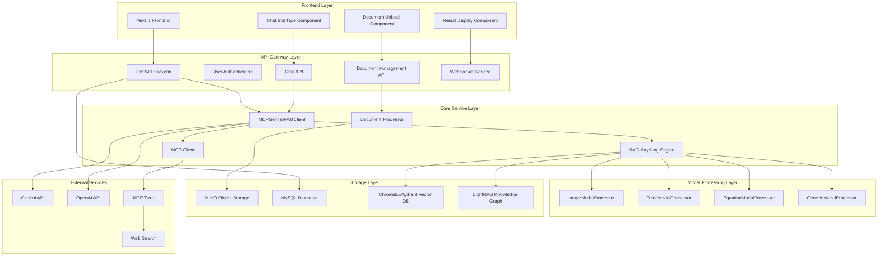

# Chat-ANYTHING System Architecture and Module Design

## 1. Chat-ANYTHING Platform Module File Structure

### 1.1 File Organization

The system adopts a front-end and back-end separation architecture, with core logic distributed across multiple modules, achieving unified integration of multimodal RAG, MCP protocol integration, and modern Web interface.

```
Chat-ANYTHING/
├── code/
│   ├── raganything/                    # RAG-Anything core engine
│   │   ├── __init__.py
│   │   ├── raganything.py             # Main RAG class implementation
│   │   ├── config.py                  # Configuration management
│   │   ├── parser.py                  # Document parsers (MinerU/Docling)
│   │   ├── processor.py               # Document processor
│   │   ├── modalprocessors.py         # Multimodal content processors
│   │   ├── query.py                   # Query processing mixin class
│   │   ├── batch.py                   # Batch processing mixin class
│   │   ├── enhanced_markdown.py       # Enhanced Markdown conversion
│   │   ├── prompt.py                  # Prompt templates
│   │   └── utils.py                   # Utility functions
│   │
│   ├── rag-web-ui/                    # Web interface system
│   │   ├── backend/                   # FastAPI backend service
│   │   │   ├── app/
│   │   │   │   ├── main.py           # FastAPI application main entry
│   │   │   │   ├── core/             # Core configuration and clients
│   │   │   │   │   ├── config.py     # System configuration
│   │   │   │   │   ├── rag_client.py # RAG client module
│   │   │   │   │   ├── security.py   # Security authentication
│   │   │   │   │   └── minio.py      # Object storage
│   │   │   │   ├── models/           # Data models
│   │   │   │   │   ├── user.py       # User model
│   │   │   │   │   ├── chat.py       # Chat model
│   │   │   │   │   ├── knowledge.py  # Knowledge base model
│   │   │   │   │   └── api_key.py    # API key model
│   │   │   │   ├── services/         # Business logic services
│   │   │   │   │   ├── my_rag.py     # MCP-Gemini-RAG integration service
│   │   │   │   │   ├── chat_service.py # Chat service
│   │   │   │   │   ├── document_processor.py # Document processing service
│   │   │   │   │   ├── llm_factory.py # LLM factory
│   │   │   │   │   ├── embedding_factory.py # Embedding model factory
│   │   │   │   │   ├── chroma.py     # ChromaDB service
│   │   │   │   │   ├── qdrant.py     # Qdrant service
│   │   │   │   │   └── server.py     # MCP server
│   │   │   │   ├── schemes/          # API data schemas
│   │   │   │   └── db/               # Database session management
│   │   │   └── requirements.txt      # Python dependencies
│   │   │
│   │   └── frontend/                  # Next.js frontend application
│   │       ├── src/
│   │       │   ├── app/              # Next.js App Router
│   │       │   ├── components/       # React components
│   │       │   │   ├── document-list.tsx
│   │       │   │   └── document-upload-steps.tsx
│   │       │   └── lib/              # Frontend utility library
│   │       │       ├── api.ts        # API client
│   │       │       └── utils.ts      # Utility functions
│   │       └── package.json          # Node.js dependencies
│   │
│   ├── mcp/                          # MCP protocol integration
│   │   ├── client.py                 # MCP client implementation
│   │   ├── server.py                 # MCP server implementation
│   │   └── testgeminiAPI.py          # Gemini API testing
│   │
│   ├── examples/                     # Usage examples
│   │   ├── raganything_example.py    # RAG-Anything complete example
│   │   ├── modalprocessors_example.py # Multimodal processing example
│   │   ├── batch_processing_example.py # Batch processing example
│   │   └── enhanced_markdown_example.py # Enhanced Markdown example
│   │
│   └── docs/                         # Documentation
│       ├── batch_processing.md
│       ├── context_aware_processing.md
│       └── enhanced_markdown.md
│
└── requirement/                      # Requirement documents
    ├── 01_project_overview.md
    └── 02_system_architecture.md
```

### 1.2 Module Responsibility Division

- **rag-web-ui/backend/**: FastAPI backend service, handles HTTP requests, user authentication, document management, and chat functionality, integrates RAG-Anything API
- **rag-web-ui/frontend/**: Next.js frontend application, provides modern user interface and interactive experience
- **mcp/**: MCP protocol integration module, implements real-time information retrieval and tool calling capabilities, encapsulates interaction between RAG-Anything and external tools
- **examples/**: RAG-Anything API call examples, demonstrating different integration modes and usage scenarios
- **docs/**: Technical documentation, detailing RAG-Anything API usage methods
- **test files/**: Test files, verifying RAG-Anything API functionality under different configurations

## 2. Chat-ANYTHING Platform Module Design

### 2.1 RAG-Anything API Integration Layer

- **Core Functionality**: Encapsulates RAG-Anything API calls, provides unified multimodal document processing and query interface
- **Main Components**: API call encapsulation, configuration management, error handling
- **Integration Modes**:
  - Supports multiple LLM provider integrations (OpenAI, Gemini, Cohere, DeepSeek)
  - Flexible configuration management, adapting to different usage scenarios
  - Unified asynchronous call interface, supporting high concurrency processing
  - Complete error handling and retry mechanisms


### 2.2 Web Backend Service (rag-web-ui/backend/)

- **Core Functionality**: Provides Web API interface, encapsulates RAG-Anything calls, handles user requests and session management
- **Main Services**: `MCPGeminiRAGClient`, `ChatService`, `DocumentProcessor`
- **RAG-Anything Integration**:
  - Encapsulates RAG-Anything API calls through `MCPGeminiRAGClient`
  - Implements asynchronous task management for document upload and processing
  - Provides unified query interface, supporting text and multimodal queries
  - Integrates MCP protocol, enabling collaboration between RAG and external tools
- **Technical Implementation**:
  - Uses FastAPI framework, supporting asynchronous processing and WebSocket real-time communication
  - Implements complete user management and permission control system
  - Supports multiple database and storage backends


### 2.3 MCP Protocol Integration (mcp/)

- **Core Functionality**: Extends RAG-Anything capabilities, integrates external tools and real-time information retrieval
- **Main Class**: `MCPGeminiRAGClient`
- **RAG-Anything Enhancement**:
  - Adds external tool calling capability on top of RAG-Anything
  - Intelligently determines if local knowledge base is sufficient, dynamically calls external tools
  - Implements intelligent fusion of RAG retrieval results and real-time information
  - Standardizes tool calling interface through MCP protocol

### 2.4 Frontend Application (rag-web-ui/frontend/)

- **Core Functionality**: User interface, document upload, chat interaction, and result display
- **Technology Stack**: Next.js 14, React, TypeScript, Tailwind CSS
- **Implementation Details**:
  - Uses App Router architecture, supporting server-side rendering and static generation
  - Implements drag-and-drop upload, progress display, and real-time chat functionality
  - Supports multimodal content display, including images, tables, and equations

## 3. Data Protocol and Module Interaction

### 3.1 API Data Protocol

The system uses Pydantic models to define strongly-typed API data structures.


### 3.2 Multimodal Processing Flow

1. **Document Upload**: Frontend uploads files to object storage via MinIO
2. **RAG-Anything Call**: Backend calls RAG-Anything API for multimodal content extraction and processing
3. **Processing Result Storage**: RAG-Anything processing results stored in configured working directory and vector database
4. **Status Management**: Backend tracks document processing status, provides processing progress feedback
5. **Query Interface**: Supports pure text queries and multimodal queries through encapsulated query interface
6. **Result Display**: Frontend displays query results, including source document citations and multimodal content

### 3.3 Real-time Query Flow

1. **User Query**: Frontend sends query request to backend API
2. **RAG Query Call**: Backend calls RAG-Anything's aquery() or aquery_with_multimodal() API
3. **Result Evaluation**: Uses LLM to judge if RAG-Anything returned results are sufficient
4. **MCP Tool Enhancement**: If needed, calls RAG-Anything's chat() API combined with MCP tools
5. **Result Fusion**: Fuses RAG retrieval results and external tool results to generate final answer
6. **Streaming Return**: Returns generated answer in real-time through WebSocket

### 3.4 System Architecture Diagram



### 3.5 Data Flow

- **Input Data**: Multi-format documents (PDF, Office, images, etc.) managed through MinIO object storage
- **API Calls**: Backend processes documents through RAG-Anything API, including process_document_complete() calls
- **Processing Results**: RAG-Anything API returns processing status and results, stored in configured working directory
- **Query Data**: Queries through aquery(), aquery_with_multimodal(), chat() and other APIs
- **Response Data**: RAG-Anything API returns query results, backend formats and enhances before returning to frontend

### 3.6 Key Features

- **RAG-Anything Integration**: Complete encapsulation of RAG-Anything API, providing unified calling interface
- **Multi-LLM Support**: Supports integration of multiple LLM providers including OpenAI, Gemini, Cohere, etc.
- **MCP Protocol Enhancement**: Adds external tool calling capability on top of RAG-Anything
- **Asynchronous Processing**: Supports asynchronous processing and status management of large-scale documents
- **Web Interface**: Provides modern Web interface, supporting document upload and real-time chat
- **Extensible Architecture**: Modular design, easy to add new integration modes and features

