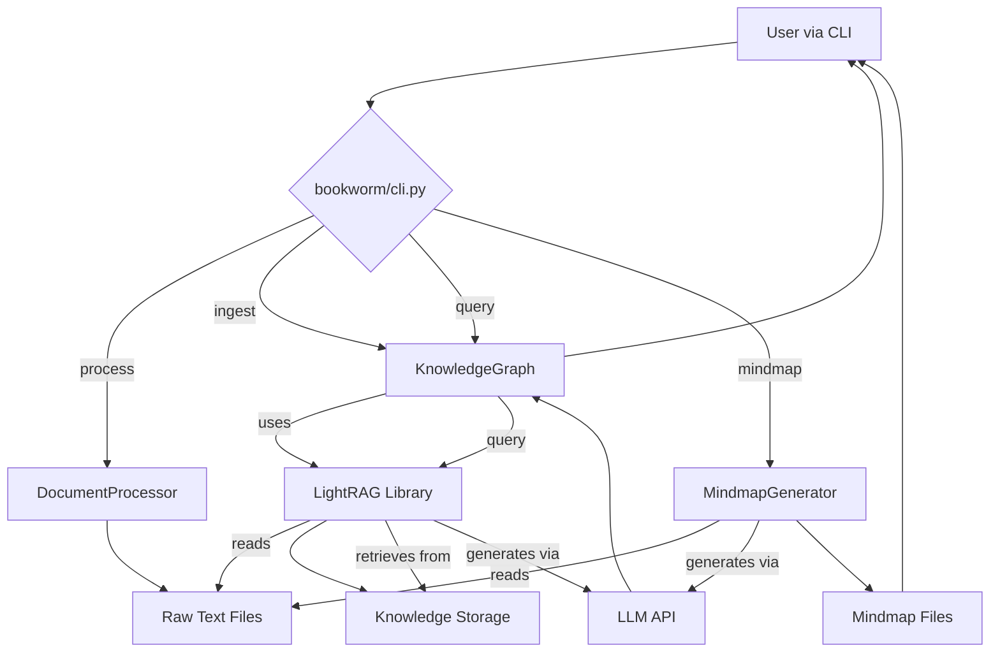

# BookWorm System Architecture and Module Design

## 1. BookWorm Module File Structure

### 1.1 File Organization

According to the project `README.md`, the BookWorm project follows a standard Python package structure.

```
BookWorm/
├── bookworm/                 # Main functionality package
│   ├── __init__.py
│   ├── core.py              # Core components (DocumentProcessor, KnowledgeGraph)
│   ├── utils.py             # Utility functions (configuration loading, logging)
│   ├── cli.py               # Command-line interface definition
│   └── mindmap_generator.py # Advanced mindmap generator
├── tests/                   # Test suite
├── examples/                # Example scripts and files
├── docs/                    # Project documentation
├── main.py                  # Command-line program entry point (uv run bookworm ...)
├── pyproject.toml           # Project dependencies and configuration (uv, ruff, black)
└── .env.example             # Environment variable template
```

### 1.2 Module Responsibility Division

- **main.py**: The main entry script of the project, used to launch the command-line application defined by `typer`.
- **bookworm/cli.py**: Uses the `typer` library to define all user-visible commands such as `process`, `ingest`, `query`, `mindmap`, and coordinates core modules to complete tasks.
- **bookworm/core.py**: Contains the core business logic of the system, primarily implementing two key classes: `DocumentProcessor` (document processing) and `KnowledgeGraph` (knowledge graph management).
- **bookworm/mindmap_generator.py**: Encapsulates the logic for interacting with Large Language Models (LLMs), specifically for generating hierarchical mindmaps from text content.
- **bookworm/utils.py**: Provides global auxiliary functions, such as loading configurations from `.env` files via `dotenv` and initializing the logging system.

## 2. BookWorm Module Design

### 2.1 Document Processor (DocumentProcessor in `core.py`)

- **Core Responsibility**: Responsible for safely and efficiently extracting plain text content and metadata from source files in various formats.
- **Main Functions**:
    - Supports multiple file formats including PDF, DOCX, TXT, Markdown, etc.
    - Provides `process_document` and `process_directory` methods, supporting both single file and batch processing of entire directories.
    - Utilizes concurrent processing to improve efficiency when handling large numbers of files.
    - Automatically extracts metadata such as filename, size, creation date, etc.

### 2.2 Knowledge Graph Manager (KnowledgeGraph in `core.py`)

- **Core Responsibility**: Manages knowledge ingestion, storage, and querying. It is a direct wrapper and application layer of the `LightRAG` library.
- **Main Functions**:
    - **Ingest (`ingest`)**: Receives text extracted by `DocumentProcessor`, calls `LightRAG` services for knowledge extraction (entities, relationships), and builds knowledge graphs and vector indexes.
    - **Query (`query`)**: Receives user questions, retrieves relevant context from the knowledge graph and vector database according to specified modes (such as `hybrid`, `local`), and calls LLM to generate answers.
    - **Persistence**: Saves the built knowledge graph and index data in the working directory (`workspace/rag_storage/`), ensuring knowledge can be reused across sessions.

### 2.3 Mindmap Generator (MindmapGenerator in `mindmap_generator.py`)

- **Core Responsibility**: Transforms unstructured document content into structured mindmaps.
- **Main Functions**:
    - **Hierarchical Analysis**: Calls LLM to perform deep analysis of text, extracting core themes, sub-themes, and key details.
    - **Multi-format Output**: Supports outputting mindmaps in Mermaid syntax, interactive HTML files, or Markdown outline format.
    - **LLM Adaptation**: Can switch between different LLMs (OpenAI, Claude, DeepSeek, etc.) based on configuration (such as `API_PROVIDER`).

### 2.4 Configuration System (`utils.py` and `.env`)

- **Core Responsibility**: Provides flexible, centralized configuration management.
- **Configuration Structure**: Uses `.env` files to store sensitive information and variable parameters.
    - `LLM API Keys`: Such as `OPENAI_API_KEY`, `ANTHROPIC_API_KEY`.
    - `Primary LLM Provider`: `API_PROVIDER`, used to specify the default LLM service provider.
    - `LightRAG Configuration`: `LLM_MODEL`, `EMBEDDING_MODEL`, `WORKING_DIR`, and other parameters required for `LightRAG` operation.
    - `Processing Settings`: `MAX_CONCURRENT_PROCESSES`, `PDF_PROCESSOR`, and other document processing-related configurations.

## 3. BookWorm Data Flow and Module Interaction

### 3.1 Data Processing Flow

1.  **Input**: User provides a directory path containing multiple documents via CLI.
2.  **Text Extraction**: `DocumentProcessor` traverses the directory, concurrently extracts plain text content from each file, and saves to `workspace/processed/`.
3.  **Knowledge Ingestion**: `KnowledgeGraph` reads the processed text, analyzes it through `LightRAG`, extracts entities and relationships, generates vector embeddings, and stores them in the knowledge base (such as graph database and vector database) in `workspace/rag_storage/`.
4.  **Mindmap Generation**: `MindmapGenerator` reads the original text, calls LLM to generate structured mindmaps, and saves to `workspace/output/`.

### 3.2 Query Flow

1.  **Input**: User inputs a natural language question via CLI.
2.  **Context Retrieval**: `KnowledgeGraph` encodes the question, performs hybrid retrieval in the knowledge base, and finds the most relevant text segments, entities, and relationships as context.
3.  **Answer Generation**: Combines the original question and retrieved context into a prompt and sends it to the configured LLM.
4.  **Output**: LLM generates an answer, and CLI displays it to the user.

### 3.3 Core Data Flow

- **Raw Data**: Document files in various formats (`.pdf`, `.docx`, etc.).
- **Intermediate Data**: Plain text files (`.txt`), generated by `DocumentProcessor`.
- **Structured Knowledge**: Knowledge graph files (GraphML), vector indexes (FAISS or Chroma), and key-value storage (TinyDB), managed by `LightRAG` in the `rag_storage` directory.
- **Final Output**: Query results (text), mindmaps (HTML, Mermaid syntax, etc.).

### 3.4 Module Interaction Diagram



