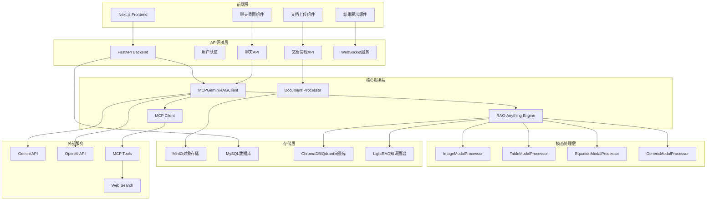

# Chat-ANYTHING 系统架构与模块设计

## 1. Chat-ANYTHING 平台模块文件结构

### 1.1 文件组织

系统采用前后端分离架构，核心逻辑分布在多个模块中，实现了多模态RAG、MCP协议集成和现代化Web界面的统一。

```
Chat-ANYTHING/
├── code/
│   ├── raganything/                    # RAG-Anything 核心引擎
│   │   ├── __init__.py
│   │   ├── raganything.py             # 主要RAG类实现
│   │   ├── config.py                  # 配置管理
│   │   ├── parser.py                  # 文档解析器 (MinerU/Docling)
│   │   ├── processor.py               # 文档处理器
│   │   ├── modalprocessors.py         # 多模态内容处理器
│   │   ├── query.py                   # 查询处理混入类
│   │   ├── batch.py                   # 批处理混入类
│   │   ├── enhanced_markdown.py       # 增强Markdown转换
│   │   ├── prompt.py                  # 提示词模板
│   │   └── utils.py                   # 工具函数
│   │
│   ├── rag-web-ui/                    # Web界面系统
│   │   ├── backend/                   # FastAPI后端服务
│   │   │   ├── app/
│   │   │   │   ├── main.py           # FastAPI应用主入口
│   │   │   │   ├── core/             # 核心配置和客户端
│   │   │   │   │   ├── config.py     # 系统配置
│   │   │   │   │   ├── rag_client.py # RAG客户端模块
│   │   │   │   │   ├── security.py   # 安全认证
│   │   │   │   │   └── minio.py      # 对象存储
│   │   │   │   ├── models/           # 数据模型
│   │   │   │   │   ├── user.py       # 用户模型
│   │   │   │   │   ├── chat.py       # 聊天模型
│   │   │   │   │   ├── knowledge.py  # 知识库模型
│   │   │   │   │   └── api_key.py    # API密钥模型
│   │   │   │   ├── services/         # 业务逻辑服务
│   │   │   │   │   ├── my_rag.py     # MCP-Gemini-RAG集成服务
│   │   │   │   │   ├── chat_service.py # 聊天服务
│   │   │   │   │   ├── document_processor.py # 文档处理服务
│   │   │   │   │   ├── llm_factory.py # LLM工厂
│   │   │   │   │   ├── embedding_factory.py # 嵌入模型工厂
│   │   │   │   │   ├── chroma.py     # ChromaDB服务
│   │   │   │   │   ├── qdrant.py     # Qdrant服务
│   │   │   │   │   └── server.py     # MCP服务器
│   │   │   │   ├── schemes/          # API数据模式
│   │   │   │   └── db/               # 数据库会话管理
│   │   │   └── requirements.txt      # Python依赖
│   │   │
│   │   └── frontend/                  # Next.js前端应用
│   │       ├── src/
│   │       │   ├── app/              # Next.js App Router
│   │       │   ├── components/       # React组件
│   │       │   │   ├── document-list.tsx
│   │       │   │   └── document-upload-steps.tsx
│   │       │   └── lib/              # 前端工具库
│   │       │       ├── api.ts        # API客户端
│   │       │       └── utils.ts      # 工具函数
│   │       └── package.json          # Node.js依赖
│   │
│   ├── mcp/                          # MCP协议集成
│   │   ├── client.py                 # MCP客户端实现
│   │   ├── server.py                 # MCP服务器实现
│   │   └── testgeminiAPI.py          # Gemini API测试
│   │
│   ├── examples/                     # 使用示例
│   │   ├── raganything_example.py    # RAG-Anything完整示例
│   │   ├── modalprocessors_example.py # 多模态处理示例
│   │   ├── batch_processing_example.py # 批处理示例
│   │   └── enhanced_markdown_example.py # 增强Markdown示例
│   │
│   └── docs/                         # 文档
│       ├── batch_processing.md
│       ├── context_aware_processing.md
│       └── enhanced_markdown.md
│
└── requirement/                      # 需求文档
    ├── 01_project_overview.md
    └── 02_system_architecture.md
```

### 1.2 模块职责划分

- **rag-web-ui/backend/**: FastAPI后端服务，处理HTTP请求、用户认证、文档管理和聊天功能，集成RAG-Anything API
- **rag-web-ui/frontend/**: Next.js前端应用，提供现代化的用户界面和交互体验
- **mcp/**: MCP协议集成模块，实现实时信息检索和工具调用能力，封装RAG-Anything与外部工具的交互
- **examples/**: RAG-Anything API调用示例，展示不同集成模式和使用场景
- **docs/**: 技术文档，详细说明RAG-Anything API的使用方法
- **test files/**: 测试文件，验证RAG-Anything API在不同配置下的功能

## 2. Chat-ANYTHING 平台模块设计

### 2.1 RAG-Anything API集成层

- **核心功能**: 封装RAG-Anything API调用，提供统一的多模态文档处理和查询接口
- **主要组件**: API调用封装、配置管理、错误处理
- **集成模式**:
  - 支持多种LLM提供商集成（OpenAI、Gemini、Cohere、DeepSeek）
  - 灵活的配置管理，适应不同使用场景
  - 统一的异步调用接口，支持高并发处理
  - 完整的错误处理和重试机制


### 2.2 Web后端服务 (rag-web-ui/backend/)

- **核心功能**: 提供Web API接口，封装RAG-Anything调用，处理用户请求和会话管理
- **主要服务**: `MCPGeminiRAGClient`, `ChatService`, `DocumentProcessor`
- **RAG-Anything集成**:
  - 通过`MCPGeminiRAGClient`封装RAG-Anything API调用
  - 实现文档上传和处理的异步任务管理
  - 提供统一的查询接口，支持文本和多模态查询
  - 集成MCP协议，实现RAG与外部工具的协同工作
- **技术实现**:
  - 使用FastAPI框架，支持异步处理和WebSocket实时通信
  - 实现完整的用户管理和权限控制系统
  - 支持多种数据库和存储后端


### 2.3 MCP协议集成 (mcp/)

- **核心功能**: 扩展RAG-Anything能力，集成外部工具和实时信息检索
- **主要类**: `MCPGeminiRAGClient`
- **RAG-Anything增强**:
  - 在RAG-Anything基础上添加外部工具调用能力
  - 智能判断本地知识库是否充分，动态调用外部工具
  - 实现RAG检索结果与实时信息的智能融合
  - 通过MCP协议标准化工具调用接口

### 2.4 前端应用 (rag-web-ui/frontend/)

- **核心功能**: 用户界面、文档上传、聊天交互和结果展示
- **技术栈**: Next.js 14, React, TypeScript, Tailwind CSS
- **实现细节**:
  - 使用App Router架构，支持服务端渲染和静态生成
  - 实现了拖拽上传、进度显示和实时聊天功能
  - 支持多模态内容展示，包括图片、表格和公式

## 3. 数据协议与模块交互

### 3.1 API 数据协议

系统使用Pydantic模型定义强类型的API数据结构：


### 3.2 多模态处理流程

1. **文档上传**: 前端通过MinIO上传文件到对象存储
2. **RAG-Anything调用**: 后端调用RAG-Anything API进行多模态内容提取和处理
3. **处理结果存储**: RAG-Anything处理结果存储在配置的工作目录和向量数据库中
4. **状态管理**: 后端跟踪文档处理状态，提供处理进度反馈
5. **查询接口**: 通过封装的查询接口支持纯文本查询和多模态查询
6. **结果展示**: 前端展示查询结果，包含源文档引用和多模态内容

### 3.3 实时查询流程

1. **用户查询**: 前端发送查询请求到后端API
2. **RAG查询调用**: 后端调用RAG-Anything的aquery()或aquery_with_multimodal() API
3. **结果评估**: 使用LLM判断RAG-Anything返回结果是否充分
4. **MCP工具增强**: 如需要，调用RAG-Anything的chat() API结合MCP工具
5. **结果融合**: 将RAG检索结果和外部工具结果融合生成最终回答
6. **流式返回**: 通过WebSocket实时返回生成的回答

### 3.4 系统架构图



### 3.5 数据流

- **输入数据**: 多格式文档(PDF、Office、图片等)通过MinIO对象存储管理
- **API调用**: 后端通过RAG-Anything API处理文档，包括process_document_complete()调用
- **处理结果**: RAG-Anything API返回处理状态和结果，存储在配置的工作目录中
- **查询数据**: 通过aquery()、aquery_with_multimodal()、chat()等API进行查询
- **响应数据**: RAG-Anything API返回查询结果，后端进行格式化和增强后返回前端

### 3.6 关键特性

- **RAG-Anything集成**: 完整封装RAG-Anything API，提供统一的调用接口
- **多LLM支持**: 支持OpenAI、Gemini、Cohere等多种LLM提供商的集成
- **MCP协议增强**: 在RAG-Anything基础上添加外部工具调用能力
- **异步处理**: 支持大规模文档的异步处理和状态管理
- **Web界面**: 提供现代化的Web界面，支持文档上传和实时聊天
- **可扩展架构**: 模块化设计，便于添加新的集成模式和功能
