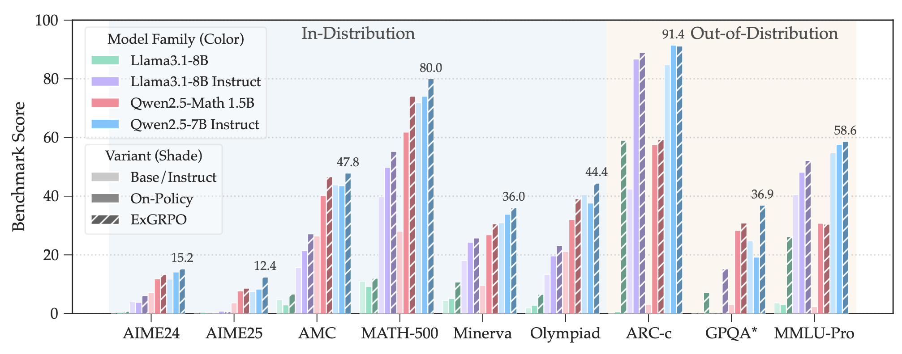

<div align="center">

<h1 style="display: flex; justify-content: center; align-items: center; gap: 10px; margin: 0;">
  ExGRPO: Learning to Reason from Experience
</h1>
<p align="center"><em>Unearth and learn high-value experience in RLVR.</em></p>

<div align="center">
  
</div>

[](https://arxiv.org/abs/2510.02245) [](https://github.com/ElliottYan/LUFFY/tree/main/ExGRPO)   [](https://huggingface.co/collections/rzzhan/exgrpo-68d8e302efdfe325187d5c96)

</div>


<div align="center" style="font-family: Arial, sans-serif;">
  <p>
    <a href="#news" style="text-decoration: none; font-weight: bold;">📢 News</a> •
    <a href="#introduction" style="text-decoration: none; font-weight: bold;">📖 Introduction</a> •
    <a href="#getting-started" style="text-decoration: none; font-weight: bold;">🚀 Getting Started</a>
  </p>
  <p>
    <a href="#usage" style="text-decoration: none; font-weight: bold;">🔧 Usage</a> •
    <a href="#evaluation" style="text-decoration: none; font-weight: bold;">📊 Evaluation</a> •
    <a href="#acknowledgement" style="text-decoration: none; font-weight: bold;">✨ Acknowledgement</a> •
    <a href="#contact" style="text-decoration: none; font-weight: bold;">📬 Contact</a> •
    <a href="#citation" style="text-decoration: none; font-weight: bold;">📝 Citation</a>
  </p>
</div>

---

# 📢News

- **[2025/10/03]** ExGRPO paper is available on [arXiv](https://arxiv.org/abs/2510.02245). 

---

# 📖Introduction

Existing RLVR methods for reasoning tasks predominantly rely on on-policy optimization, which discards online rollouts after a single update, wasting valuable exploration signals and constraining scalability.
We conduct a systematic analysis of experience utility in RLVR and identify question difficulty and trajectory entropy as effective online proxies for assessing experience quality.
Building on these insights, we propose *ExGRPO*, a novel framework that **strategically manages and replays high-value experiences** through bucketed prioritization and mixed-policy optimization, enabling more efficient and stable RLVR training.

### Key Highlights:
- **Experience Value Modeling**: Introduces the online proxy metrics: rollout correctness and trajectory entropy, for quantifying the value of RLVR experience.
- **ExGRPO Framework**: Built on top of GRPO, ExGRPO introduces a systematic experience management mechanism and an experience optimization objective to maximize the benefit of past explorations.
- **Generalization and Stability**: Demonstrates broad applicability across different backbone models and mitigates training collapse of on-policy RLVR in challenging scenarios.

---

# 🚀Getting Started

## Installation

You can install dependencies by running the following commands:
```bash
conda create -n exgrpo python=3.10
conda activate exgrpo
cd exgrpo
pip install -r requirements.txt
pip install -e .
cd verl
pip install -e .
```
> **Note**: If you encounter issues caused by the `pyairports` library, please refer to this hot-fix [solution](https://github.com/ElliottYan/LUFFY?tab=readme-ov-file#update-98).

For the `flash-attn` library, we use the `v2.7.4-post1` release and recommend installing it via the pre-built wheel. Please adjust based on your environment.
```bash
wget https://github.com/Dao-AILab/flash-attention/releases/download/v2.7.4.post1/flash_attn-2.7.4.post1+cu12torch2.4cxx11abiFALSE-cp310-cp310-linux_x86_64.whl
pip install flash_attn-2.7.4.post1+cu12torch2.4cxx11abiFALSE-cp310-cp310-linux_x86_64.whl
```


## ExGRPO Plug-and-Play Modules Structure

**ExGRPO** extends `verl` framework by introducing plug-and-play experience modules, following a design similar to that of `LUFFY`. It focuses on the `experience/` submodule and the trainer `mix_trainer_experience.py`, enabling dynamic integration of on-policy data with collected experiences. 
The key modules are structured as follows:

```text
exgrpo/verl/verl/mix_src
├── ...
├── experience
│   ├── experience_bucket_manager.py    # Abstraction of experience bucket; stats & maintenance
│   ├── weighted_bucket_sampler.py      # Probabilistic experience sampler (across/within buckets)
│   ├── experience_collate_fn.py        # Mix fresh on-policy data with experience per batch
│   ├── experience_helpers.py           # Sampling, metric computation, sample builders used by collate_fn
│   ├── experience_trainer_ops.py       # Trainer-side experience management operations
│   └── rl_dataset_with_experience.py   # Dataset class for ExGRPO training
├── ...
├── mix_trainer_experience.py           # ExGRPO Trainer
└── ...

    # Additional Training/Runtime Modules:
    are largely similar to those in `LUFFY`, with minor modifications to components such as the rollout     
    mechanism, checkpoint manager, and FSDPworker to better align with the requirements of ExGRPO.
```

---

# 🔧Usage

## Data Preparation
You need to first run the data preparation script to get the training data in parquet format.
```bash
cd data
python prepare_train.py --dataset_name Elliott/Openr1-Math-46k-8192 --output_file openr1.parquet
```

> **Note**: Although we utilize the OpenR1 data, only the question field is used in RLVR. The ExGRPO data processing pipeline does not incorporate the external R1 trajectory during training.


## Training

We provide an example script to train ExGRPO on 46k-subset of OpenR1-Math-220k. You can run the following command to train:

```bash
  cd exp_scripts
  bash run_exgrpo.sh
```

For Qwen2.5-Math-7B backbone model, we use [this version](https://huggingface.co/Elliott/Qwen2.5-Math-7B-16k-think). 
Other Qwen backbone models follow the same prompt template. 

## Configuration Quick Reference

Key fields read by the ExGRPO components (names reflect usage in training scipts):

- `trainer.experience` (bool): Enable ExGRPO training.
- `trainer.experience_ratio` (float): Fraction of each batch taken from the experience pool in mixed training.
- `trainer.exp_metric` (str): Metric for trajectory selection. Default: `ent`.
- `exp_bucket_manager` (str|bool): Probabilistic bucket sampling method. Default: `normal`.
- `exp_is_correct` (bool): Enable importance sampling correction for experiential trajectories.
- `experience_lbound` / `experience_rbound` (int): Eligibility bounds on number of successes recorded per question (lbound, rbound].

---

# 📊Evaluation

## Reproducing the Results 
We currently support automated evaluation on six widely used mathematical reasoning benchmarks (AIME24/25, AMC, MATH-500, Minerva, and Olympiad) and three out-of-distribution tasks (ARC-c, GPQA-diamond, and MMLU-pro).


You can reproduce our results by running the following commands:
```bash
ROOT= # Your Root Path
TEMPLATE=own
MODEL_PATH= # Your checkpoint Path
OUTPUT_DIR=results/

DATA=$ROOT/data/valid.id.parquet
MODEL_NAME=exgrpo+testid

mkdir -p $OUTPUT_DIR

python generate_vllm.py \
  --model_path $MODEL_PATH \
  --input_file $DATA \
  --remove_system True \
  --add_oat_evaluate True \
  --output_file $OUTPUT_DIR/$MODEL_NAME.jsonl \
  --template $TEMPLATE > $OUTPUT_DIR/$MODEL_NAME.log
```

## Main Results

### Zero RLVR on Qwen2.5-Math-7B & Continual RLVR on LUFFY
<div align="center">
  
</div>

### Zero RLVR on Llama3.1-8B (Base, Instruct), Qwen2.5-Math 1.5B Base, Qwen2.5-7B Instruct
<div align="center">
  
</div>

<details>
<summary>Click to view full results of model extension</summary>
<div align="center">
  
</div>
</details>

## Released Models
| **Model**                          | **Huggingface** |  **Base Model** |
|-----------------------------------|------------------|------------------|
| ExGRPO-Qwen2.5-Math-7B-Zero | https://huggingface.co/rzzhan/ExGRPO-Qwen2.5-Math-7B-Zero |  Qwen2.5-Math-7B |
| ExGRPO-LUFFY-7B-Continual | https://huggingface.co/rzzhan/ExGRPO-LUFFY-7B-Continual | LUFFY-Qwen-Math-7B-Zero |
| ExGRPO-Qwen2.5-7B-Instruct | https://huggingface.co/rzzhan/ExGRPO-Qwen2.5-7B-Instruct |  Qwen2.5-7B Instruct |
| ExGRPO-Qwen2.5-Math-1.5B-Zero | https://huggingface.co/rzzhan/ExGRPO-Qwen2.5-Math-1.5B-Zero |  Qwen2.5-Math-1.5B |
| ExGRPO-Llama3.1-8B-Zero | https://huggingface.co/rzzhan/ExGRPO-Llama3.1-8B-Zero |  Llama3.1-8B |
| ExGRPO-Llama3.1-8B-Instruct | https://huggingface.co/rzzhan/ExGRPO-Llama3.1-8B-Instruct |  Llama3.1-8B Instruct |


# ✨Acknowledgement

ExGRPO builds upon [LUFFY](https://github.com/ElliottYan/LUFFY), [veRL](https://github.com/volcengine/verl) and [deepscaler](https://github.com/agentica-project/rllm), and utilizes [vLLM](https://github.com/vllm-project/vllm) for inference. We utilize [Math-Verify](https://github.com/huggingface/Math-Verify) for RLVR reward model. 
We thank the open-source community for datasets and backbones, including [NuminaMath](https://huggingface.co/datasets/AI-MO/NuminaMath-CoT), [OpenR1-Math-220k](https://huggingface.co/datasets/open-r1/OpenR1-Math-220k), [OpenR1-Math-46k](https://huggingface.co/datasets/Elliott/Openr1-Math-46k-8192), [Qwen-2.5-Math](https://huggingface.co/collections/Qwen/qwen25-math-66eaa240a1b7d5ee65f1da3e), [Qwen-2.5](https://huggingface.co/collections/Qwen/qwen25-66e81a666513e518adb90d9e) and [Llama-3.1](https://huggingface.co/collections/meta-llama/llama-31-669fc079a0c406a149a5738f) model. 

# 📬Contact

For questions, feedback, or collaboration opportunities, feel free to reach out:
- Runzhe Zhan: nlp2ct.runzhe@gmail.com
- Yafu Li: yafuly@gmail.com

# 📝Citation
If you find our model, data, or evaluation code useful, please kindly cite our paper:
```bib
@article{zhan2025exgrpo,
      title={ExGRPO: Learning to Reason from Experience}, 
      author={Runzhe Zhan and Yafu Li and Zhi Wang and Xiaoye Qu and Dongrui Liu and Jing Shao and Derek F. Wong and Yu Cheng},
      year={2025},
      journal = {ArXiv preprint},
      volume = {2510.02245},
      url={https://arxiv.org/abs/2510.02245}, 
}
```
