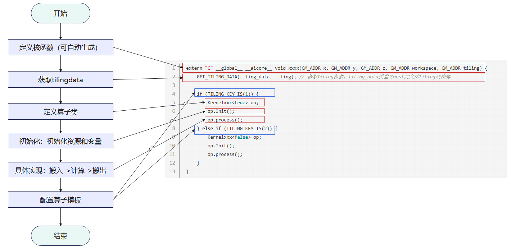
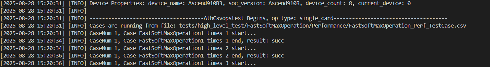

# ATB算子开发指南
## ATB算子开发介绍

### 与非ATB算子开发的不同

* Ascend C是CANN针对算子开发场景推出的编程语言，使用Ascend C开发者可以自行开发算子，高效的实现自定义的创新算法；
* 算子开发包含tiling开发和kernel开发两部分；
* ATB算子开发则是基于已有算子库进行新增算子的实现，避免重复开发算子的工作，但是需要将算子接入ATB，编写ATB算子的对外接口。

### ATB算子开发流程


（1）环境准备

- CANN软件安装请参考[环境准备](https://www.hiascend.com/document/detail/zh/canncommercial/82RC1/opdevg/Ascendcopdevg/atlas_ascendc_10_0002.html)(左上角可切换至最新版本，后文同此操作)。

（2）算子实现

- Kernel侧算子实现和host侧tiling实现，与非ATB算子开发大体相同（可参考[算子实现](https://www.hiascend.com/document/detail/zh/canncommercial/82RC1/opdevg/Ascendcopdevg/atlas_ascendc_10_0030.html)），本文档主要给出不同之处。

（3）ATB接入

- tiling和kernel开发使atb加速库具备了算子的处理计算能力，但是想要通过ATB op对外提供单算子调用以及算子组图能力，还需要进行operation/runner开发，此步骤是单独进行Ascend C算子开发没有的。

（4）构建与测试

- 编译：使用脚本进行编译构建；
- 测试用例编写：编写测试用例进行算子调用，以及测量所写算子与对标算子的误差。  
注意：构建与测试过程遇到问题，您可参考[ATB日志与调试](./日志与调试.md)尝试解决。

## ATB算子开发

### 交付件

新增ATB算子对文件的结构和内容带来的改变体现在两个方面：

* 算子实现：tiling开发和kernel开发
* ATB框架接入：通过ATB 接口对外提供单算子调用以及算子组图能力，开发算子OP带来的文件修改

**注意**：后文将以新增一个融合算子`fastsoftmax`为例，讲述需要在atb仓新增哪些内容，做哪些改动。

#### 算子实现交付件

##### 新增文件说明

* 新增`src/kernels/include/atbops/params/fastsoftmax.h`文件定义 `FastSoftMax` 操作的参数结构体，内容如下
  ```c++
  #ifndef ATBOPS_PARAMS_FASTSOFTMAX_H
   #define ATBOPS_PARAMS_FASTSOFTMAX_H
  
   #include <cstdint>
   #include <string>
   #include <sstream>
   #include <mki/utils/SVector/SVector.h>
  
   namespace AtbOps {
   namespace OpParam {
   struct FastSoftMax {
       std::vector<int32_t> qSeqLen;
       int32_t headNum = 0;
  
       bool operator==(const FastSoftMax &other) const
       {
           return this->qSeqLen == other.qSeqLen && this->headNum == other.headNum;
       }
   };
  
   } // namespace OpParam
   } // namespace AtbOps
  
   #endif // ATBOPS_PARAMS_FASTSOFTMAX_H
  
  ```
* 在`src/kernels/mixkernels`下新增`fastsoftmax`目录，文件具体内容见后文，目录结构如下：

  ```
    fastsoftmax
    ├── op_kernel			        // kernel侧实现文件(包括核函数入口、以及实现文件)	
    │   └── fast_softmax.cpp
    ├── tiling			            // 新增算子tiling
    │   ├── fastsoftmax_tiling.cpp	// tiling实现核心算法
    │   ├── fastsoftmax_tiling.h	// 算子tiling接口
    │   └── tiling_data.h			// tiling和kernel传递结构体tiling_data的定义 
    ├── CMakeLists.txt			    // 新增算子编译CMake
    ├── fastsoftmax_kernel.cpp		// 校验
    └── fastsoftmax_operation.cpp	// shape验证
  ```

* 新增`tests/apitest/kernelstest/mix/test_fastsoftmax.py`文件用于精度测试
* 新增`tests/apitest/opstest/csv/fast_soft_max.csv`文件，提供算子输入测试样例

##### 修改文件说明

* 将新增的头文件加入到`src/kernels/include/atbops/params/params.h`的头文件中

  ```c++
    #include "atbops/params/fastsoftmax.h"
  ```

* `tests/framework/python/CsvOpsTestTool/data_generation.py`中增加`FastSoftMaxOperation`类，包含gloden函数定义、误差比较等方法。
* `src/kernels/configs/mixkernels/op_list.yaml` 文件直接删除或者增加以下内容（**这一内容非常重要**，将新增算子信息加入列表，后续构建才会将新增算子的实现和接口真正编译进去，如果添加的不是融合算子则操作`src/kernels/configs/kernels/op_list.yaml`文件）：

  ```
  FastSoftMaxOperation:
    FastSoftMaxKernel:
        ascend910b: true
  ```

#### ATB接入交付件

##### 新增文件说明

- 根据算子类型属于推理还是训练，分别选择在`src/ops_infer`或`src/ops_train`目录下新增算子名称的目录。对于`fastsoftmax`的OP，在`src/ops_train`下新增目录`fast_soft_max`，文件具体内容见后文，目录结构如下：
  ```
    fast_soft_max
    ├── fastsoftmax_operation.cpp	// atb接口实现
    ├── fastsoftmax_operation.h	
    ├── fastsoftmax_ops_runner.cpp	// 算子组图
    └── fastsoftmax_ops_runner.h
  ```

- 新增文件夹`tests/apitest/opstest/python/operations/fast_soft_max`，进行精度测试，完整内容可查看atb仓

  ```
  fast_soft_max
  ├── __init__.py
  └── test_fastsoftmax_operation.py
  ```

##### 修改文件说明


* 在`src/atb/runner/runner_type.h`中为``RunnerType``增加枚举值`RUNNER_TYPE_FASTSOFTMAX`
* 在`tests/framework/c++/atb_torch/operation/operation_funcs.cpp`新增功能：把 JSON 描述的 FastSoftMax 参数反序列化成 C++ 结构体，然后用它创建或更新算子

  ```c++
   static atb::train::FastSoftMaxParam GetFastSoftMaxParamFromJson(const nlohmann::json &paramJson)
   {
       atb::train::FastSoftMaxParam param;
       if (paramJson.contains("headNum")) {
           param.headNum = paramJson["headNum"].get<int32_t>();
       }
       if (paramJson.contains("qSeqLen")) {
           for (auto item : paramJson["qSeqLen"]) {
               param.qSeqLen.push_back(item.get<int32_t>());
           }
       }
       if (paramJson.contains("rsv")) {
           for (size_t i = 0; i < paramJson["rsv"].size(); i++) {
               param.rsv[i] = paramJson["rsv"].at(i).get<int8_t>();
           }
       }
       return param;
   }
  
   static atb::Status FastSoftMaxOperationCreate(const nlohmann::json &paramJson, atb::Operation **op)
   {
       return CreateOperation(GetFastSoftMaxParamFromJson(paramJson), op);
   }
  
   static atb::Status FastSoftMaxOperationUpdate(const nlohmann::json &paramJson, atb::Operation *op)
   {
       return UpdateOperationParam(op, GetFastSoftMaxParamFromJson(paramJson));
   }
  
  ```

  在该文件的`g_funcMap`、`g_update_funcMap`中也要增加对应键值对。

* 在`include/atb/train_op_params.h`，新增

  ```C++
    //!
    //! \struct FastSoftMaxParam
    //!
    //! \brief 将unpad处理后的Q矩阵和K矩阵相乘的结果做Softmax处理。当前仅支持Atlas A2/A3推理训练产品。
    //!
    //! \warning seqLen数组长度不超过32，且要求各元素大于0。
    //!
   struct FastSoftMaxParam {
       //! \brief Attention的head数量。
       int32_t headNum = 0;
       //! \brief 每个batch的实际输入长度。元素个数为batchSize，最大不超过32
       std::vector<int32_t> qSeqLen;
       //!
       //! \brief 预留参数
       //!
       uint8_t rsv[8] = {0};
   };
  
   //!
   //! \brief 判断参数是否相同
   //!
   //! \param left
   //! \param right
   //!
   //! \return bool值
   //!
   inline bool operator==(const FastSoftMaxParam &left, const FastSoftMaxParam &right)
   {
       return left.headNum == right.headNum && left.qSeqLen == right.qSeqLen;
   }
  
  ```

- 在`src/atb/utils/param_to_json.cpp`新增以下内容

  ```c++
    template <> nlohmann::json OpParamToJson(const train::FastSoftMaxParam &opParam)
    {
        nlohmann::json paramsJson;
        paramsJson["headNum"] = opParam.headNum;
        paramsJson["qSeqLen"] = opParam.qSeqLen;

        return paramsJson;
    }
  ```

- 在`src/kernels/mixkernels/param_to_json.cpp`增加

  ```c++
  std::string FastSoftMaxToJson(const Any &param)
  {
    nlohmann::json paramsJson;
    OpParam::FastSoftMax specificParam = AnyCast<OpParam::FastSoftMax>(param);
  
    paramsJson["qSeqLen"] = specificParam.qSeqLen;
    paramsJson["headNum"] = specificParam.headNum;
  
    return paramsJson.dump();
  }
  ```

  以及`REG_STRINGIFY(OpParam::FastSoftMax, FastSoftMaxToJson);`

- 在`ops_configs/atb_ops_info.ini`增加算子描述

  ```
  [FastSoftMaxOperation]
  input0.name=x
  input0.dtype=float16
  input0.format=nd
  output0.name=output
  output0.dtype=float16
  output0.format=nd
  ```

### tiling开发

算子开发的核心概念：`TilingData`、`Workspace`、`TilingKey`、`BlockDim`等，可访问[术语表-CANN商用版8.2.RC1-昇腾社区](https://www.hiascend.com/document/detail/zh/canncommercial/82RC1/opdevg/Ascendcopdevg/atlas_ascendc_10_00013.html)查看。

#### 代码实现

与tiling相关的文件是`tiling_data.h`、`fastsoftmax_tiling.h`、`fastsoftmax_tiling.cpp`文件。

**注意**：ATB算子开发与[Ascend C算子开发](https://www.hiascend.com/document/detail/zh/canncommercial/82RC1/opdevg/Ascendcopdevg/atlas_ascendc_10_0001.html)不同点主要在于**TilingData**结构的定义和使用上，Ascend C使用`BEGIN_TILING_DATA_DEF`注册结构体，ATB算子开发需要用户直接定义。代码内容的功能都是一致的，只需要注意与结构体相关部分的代码编写。

##### tiling_data.h

文件路径：`src/kernels/mixkernels/fastsoftmax/tiling/tiling_data.h`

完整内容可根据文件路径在代码仓查看，`tiling_data.h`头文件主要包含两部分内容：

- **常量定义**：用于固定一些关键参数，这些参数在算子的实现中会被频繁使用。
- **数据结构定义**：用于描述算子的输入和输出数据的结构。两处结构体定义，分别用于描述输入数据的基本信息、具体的数据分块和处理细节，便于在算子实现中进行数据处理和传递。

##### fastsoftmax_tiling.h

文件路径：`src/kernels/mixkernels/fastsoftmax/tiling/fastsoftmax_tiling.h`
tiling过程主要是完成数据的切分，因此其主体函数是实现切分功能的函数，这里则是函数声明。

```C++
#ifndef ASCEND_OPS_FASTSOFTMAX_TILING_H
#define ASCEND_OPS_FASTSOFTMAX_TILING_H

#include <mki/launch_param.h>
#include <mki/utils/status/status.h>
#include <mki/kernel_info.h>

namespace AtbOps {
using namespace Mki;
Status FastSoftMaxTiling(const LaunchParam &launchParam, KernelInfo &kernelInfo);

}  // namespace AtbOps

#endif  // ASCEND_OPS_FASTSOFTMAX_TILING_H
```

##### fastsoftmax_tiling.cpp

文件路径：`src/kernels/mixkernels/fastsoftmax/tiling/fastsoftmax_tiling.cpp`
主体函数与编写说明如下：

```C++
Status FastSoftMaxTiling(const LaunchParam &launchParam, KernelInfo &kernelInfo)
{
    // 获取平台信息，物理核数和缓冲区大小
    uint32_t coreNum = PlatformInfo::Instance().GetCoreNum(CoreType::CORE_TYPE_VECTOR);
    uint32_t ubSize = PlatformInfo::Instance().GetUbSize();
    // 获取算子参数
    auto param = AnyCast<OpParam::FastSoftMax>(launchParam.GetParam());
    uint32_t batchSize = param.qSeqLen.size();
    uint32_t headNum = static_cast<uint32_t>(param.headNum);
    MKI_CHECK(headNum > 0, "head Num is invalid", return Status::FailStatus(ERROR_INVALID_VALUE));

    // 初始化切片数据
    uint8_t *tiling = kernelInfo.GetTilingHostAddr();
    auto tilingDataPointer = reinterpret_cast<FastSoftMaxTilingData *>(tiling);
    tiling += sizeof(FastSoftMaxTilingData);
    MKI_CHECK(tilingDataPointer != nullptr, "tilingData should not be empty",
        return Status::FailStatus(ERROR_INVALID_VALUE));
    tilingDataPointer->batchSize = batchSize;
    tilingDataPointer->headNum = headNum;

    // 处理每个切片，设置长度、偏移量等信息
    uint32_t dataOffset = 0;
    for (uint32_t sampleIndex = 0; sampleIndex < batchSize; ++sampleIndex) {
        uint32_t sampleSeqLenOrigin = static_cast<uint32_t>(param.qSeqLen[sampleIndex]);
        MKI_CHECK(sampleSeqLenOrigin > 0 && sampleSeqLenOrigin <= MAX_SEQ_LEN, "seqlen is invalid",
            return Status::FailStatus(ERROR_INVALID_VALUE));
        auto sampleTilingDataPointer = reinterpret_cast<FastSoftMaxSampleTilingData *>(tiling);
        tiling += sizeof(FastSoftMaxSampleTilingData);
        SetSampleTilingData(sampleTilingDataPointer, ubSize, coreNum, headNum, sampleSeqLenOrigin);
        uint32_t dataLength = headNum * sampleSeqLenOrigin * sampleSeqLenOrigin;
        sampleTilingDataPointer->dataLength = dataLength;
        sampleTilingDataPointer->dataOffset = dataOffset;
        dataOffset += dataLength;
    }
    // 设置逻辑核维度
    kernelInfo.SetBlockDim(coreNum);
    return Status::OkStatus();
}
```

#### 流程详解


tiling的策略与kernel的实现配套，tiling指导kernel的内存分配和切分，tiling与kernel信息传递通过tilingdata进行传递


### kernel开发

kernel相关的`Compute`、`CopyIn`、`CopyOut`等概念，可访问[术语表-CANN商用版8.2.RC1-昇腾社区](https://www.hiascend.com/document/detail/zh/canncommercial/82RC1/opdevg/Ascendcopdevg/atlas_ascendc_10_00013.html)查看。

#### 代码实现

Kernel即算子执行二进制文件，kernel实现即算子device执行代码实现，根据tiling信息完成所有数据的搬运和计算。
**注意**：因`TilingData`结构的定义和使用方式不同而造成ATB算子与[Ascend C算子kernel开发](https://www.hiascend.com/document/detail/zh/canncommercial/82RC1/opdevg/Ascendcopdevg/atlas_ascendc_10_0063.html)有不同点。

* 在Ascend C算子开发中，调用`GET_TILING_DATA(tilingData, tiling);`获取`TilingData`；而ATB算子开发中，使用如下方式：

    ```C++
    FastSoftMaxTilingData tilingData = GetTilingData(tiling);
    ```

* 启动kernel侧实现前，`src/kernels/mixkernels/fastsoftmax/fastsoftmax_kernel.cpp`中对输入和输出进行了检查，以及进行kernel侧的初始化

##### fast_softmax.cpp

文件路径：`src/kernels/mixkernels/fastsoftmax/op_kernel/fast_softmax.cpp`

与Ascend C算子kernel开发主要区别在于，获取`tilingData`的方式不同，用户可定义GetTilingData函数，区别代码如下：

```C++
inline __aicore__ FastSoftMaxTilingData GetTilingData(const GM_ADDR tiling)
{
    auto tilingDataPointer = reinterpret_cast<const __gm__ FastSoftMaxTilingData *>(tiling);
    FastSoftMaxTilingData tilingData;
    tilingData.batchSize = tilingDataPointer->batchSize;
    tilingData.headNum = tilingDataPointer->headNum;
    return tilingData;
}
extern "C" __global__ __aicore__ void fastsoftmax(GM_ADDR dataInput, GM_ADDR dataOutput, GM_ADDR tiling)
{
    FastSoftMaxTilingData tilingData = GetTilingData(tiling);
    tiling += sizeof(FastSoftMaxTilingData);
    for (uint32_t sampleIndex = 0; sampleIndex < tilingData.batchSize; ++sampleIndex) {
        FastSoftMaxSampleTilingData sampleTilingData = GetSampleTilingData(tiling);
        FastSoftmax op;
        op.Init(dataInput, dataOutput, sampleTilingData);
        op.Process();
        tiling += sizeof(FastSoftMaxSampleTilingData);
    }
}
```

##### fastsoftmax_kernel.cpp

文件路径：`src/kernels/mixkernels/fastsoftmax/fastsoftmax_kernel.cpp`
启动kernel侧实现前，对输入和输出进行了检查，以及进行kernel侧的初始化。

```C++
#include <mki/base/kernel_base.h>
#include <mki_loader/op_register.h>
#include <mki/utils/log/log.h>
#include "atbops/params/params.h"
#include "tiling/fastsoftmax_tiling.h"
#include "tiling/tiling_data.h"

namespace AtbOps {
using namespace Mki;
class FastSoftMaxKernel : public KernelBase {
public:
    explicit FastSoftMaxKernel(const std::string &kernelName, const BinHandle *handle) noexcept
        : KernelBase(kernelName, handle)
    {
    }
    // 检查当前 kernel 是否支持给定的 LaunchParam
    bool CanSupport(const LaunchParam &launchParam) const override
    {
        MKI_CHECK(launchParam.GetInTensorCount() == 1, "in tensor num invalid", return false);
        MKI_CHECK(launchParam.GetOutTensorCount() == 1, "out tensor num invalid", return false);
        MKI_CHECK(launchParam.GetParam().Type() == typeid(OpParam::FastSoftMax),
            "param type invalid", return false);
        return true;
    }
    // 返回 tiling数据结构的字节大小
    uint64_t GetTilingSize(const LaunchParam &launchParam) const override
    {
        MKI_CHECK(launchParam.GetParam().Type() == typeid(OpParam::FastSoftMax),
            "param type invalid", return 0);
        auto param = AnyCast<OpParam::FastSoftMax>(launchParam.GetParam());
        auto batchSize = param.qSeqLen.size();
        MKI_CHECK(batchSize > 0 && batchSize <= MAX_BATCH_SIZE, "batch size invalid", return 0);
        return sizeof(FastSoftMaxTilingData) + batchSize * sizeof(FastSoftMaxSampleTilingData);
    }
    // 初始化 kernel 的执行参数，生成 tiling 数据
    Status InitImpl(const LaunchParam &launchParam) override
    {
        return FastSoftMaxTiling(launchParam, kernelInfo_);
    }
};

REG_KERNEL_BASE(FastSoftMaxKernel);

}  // namespace AtbOps
```

#### 流程详解


具体编写说明，可查看[核函数-CANN商用版8.2.RC1-昇腾社区](https://www.hiascend.com/document/detail/zh/canncommercial/82RC1/opdevg/Ascendcopdevg/atlas_ascendc_10_0014.html#ZH-CN_TOPIC_0000002370175061__zh-cn_topic_0000001447989210_section1915102519220)。

### ATB算子接入

**Operation**：`Operation` 是 ATB 加速库中面向用户的前端接口，用于创建和管理算子。用户通过创建 `Operation` 对象来执行算子。
**Runner**： `Operation`的执行单元，可以理解为`Operation` 的后端处理逻辑。`Runner` 负责具体执行算子的计算任务，包括调用内核函数、管理设备内存、处理 Tiling 数据等。

下面提供ATB算子简单接入方式、完善的接入方式，完善的接入方式相比简单接入包含了对传入的tensor的类型、维度、格式等的校验，代码量大，初学者可选择简单接入方式，更快上手。

#### 简单接入

##### runner

###### 代码结构

| 名称                   | 访问修饰符      | 类型           | 描述                                                                              |
| ------------------------ | ----------------- | ---------------- | ----------------------------------------------------------------------------------- |
| `FastSoftMaxOpsRunner`     | `public`    | 成员函数       | 构造函数。重写`OpsRunner`父类实现，一般不需要做任何操作。                     |
| `~FastSoftMaxOpsRunner`    | `public`    | 成员函数       | 析构函数。重写`OpsRunner`父类实现，一般不需要做任何操作。                     |
| `SetParam`         | `public`    | 成员函数       | 动态修改参数时，实现对类成员变量`param_`的修改，并更新`isParamUpdated_`。(有修改需要的时候写) |
| `SetupKernelGraph` | `protected` | 成员函数       | 重写`OpsRunner`父类实现，实现OP组图功能，是runner中的关键功能。               |
| `param_`           | `private`   | 成员变量       | OP的参数结构体实例。 |

###### fastsoftmax_ops_runner.h

文件路径：`src/ops_train/fast_soft_max/fastsoftmax_ops_runner.h`
完整内容可根据路径在代码仓中查看。

###### fastsoftmax_ops_runner.cpp

**文件路径**：`src/ops_train/fast_soft_max/fastsoftmax_ops_runner.cpp`
完整内容可根据路径在代码仓中查看。

**代码说明：**
a. 根据算子需求包含头文件`atbops/params/params.h`；
b. 建议定义常量，或在代码行添加注释，使变量利于理解；
c. `RUNNER_TYPE_FASTSOFTMAX`为runner类型枚举值，定义在代码仓`src/include/atb/core/runner_type.h`文件中；
d. 根据使用方式（作为`atb::SVector.at()`/`atb::SVector.resize()`等函数参数），`inTensorId`、`SIZE_2`等变量、常量建议定义为`size_t`类型；
e.  `AsdOps::OpDesc`配置时，需确保`OpName`配置正确，否则可能会导致找不到kernel等问题；

##### operation

###### 代码结构

| 名称                      | 访问修饰符      | 类型     | 描述                                                                                  |
| --------------------------- | ----------------- | ---------- | --------------------------------------------------------------------------------------- |
| `FastSoftMaxOperation `        | `public`    | 成员函数 | 构造函数。重写`OpsRunner`父类实现，进行IR配置并初始化其他自定义成员变量。         |
| `~FastSoftMaxOperation `       | `public`    | 成员函数 | 析构函数。重写`OpsRunner`父类实现，一般不需要做任何操作。                         |
| `GetInputNum`         | `public`    | 成员函数 | 重写`OperationBase`父类实现，返回OP的输入Tensor数量，返回值类型为`uint32_t`。 |
| `GetOutputNum`        | `public`    | 成员函数 | 重写`OperationBase`父类实现，返回OP的输出Tensor数量，返回值类型为`uint32_t`。 |
| `SetParam`            | `public`    | 成员函数 | 动态修改参数时，实现对类成员变量`param_`的修改，并重置对应的`runner_`指针。   |
| `GetParam`            | `public`    | 成员函数 | 返回私有成员变量`param_`的值。                                                    |
| `InferShapeImpl`      | `protected` | 成员函数 | 根据输入TensorDesc推导输出TensorDesc。                                                |
| `InferShapeCheckImpl` | `protected` | 成员函数 | 在`InferShape`接口调用时对输入TensorDesc进行校验。                                |
| `SetupCheckImpl`      | `protected` | 成员函数 | 在`Setup`接口调用时对输入Tensor和输出Tensor进行校验。                             |
| `CreateRunner`        | `protected` | 成员函数 | 创建Runner。                                                                          |
| `GetParamJson`        | `protected` | 成员函数 | 将OP参数转为json，主要用于维测。                                                      |
| `param_`              | `private`   | 成员变量 | OP的参数结构体实例。                                                                  |

###### fastsoftmax_operation.h

**文件路径：**`src/ops_train/fast_soft_max/fastsoftmax_operation.h`

完整内容可根据文件路径查看。

**代码说明：**

a. `InferShapeCheckImpl`、`SetupCheckImpl`、`GetParamJson`为检验函数，初学者可直接返回指定值；

b. 建议用户定义``CheckInTensorDescs``和`CheckOutTensor`函数，可根据需要修改函数参数，具体编写参看后面完整接入说明；

* `InferShapeCheckImpl`函数调用`CheckInTensorDescs`函数；
* `SetupCheckImpl`函数中，将参数`inTensors`通过`OperationUtil::InTensorsToInTensorDescs`函数转为`inTensorDescs`，再按顺序调用`CheckInTensorDescs`和`CheckOutTensor`函数；

c. 如果OP支持输入为空Tensor，重写`GetEmptyInTensorPermissions`函数

###### fastsoftmax_operation.cpp

**文件路径：**`src/ops_train/fast_soft_max/fastsoftmax_operation.cpp`
检验功能的相关函数可直接返回值，主要编写非校验函数的内容。

```c++
#include "fastsoftmax_operation.h"
#include "fastsoftmax_ops_runner.h"
#include "atb/utils/config.h"
#include "atb/utils/tensor_check.h"
#include "atb/utils/param_to_json.h"
#include "atb/core/atb_operation_ir_cfg.h"
#include "atb/core/op_param_funcs.h"
#include "atb/utils/operation_util.h"
#include "atb/utils/singleton.h"

namespace {
constexpr int32_t MAX_SEQLEN = 4096;
// 校验函数，直接返回
bool ParamCheck(const atb::train::FastSoftMaxParam &opParam)
{
    return true;
}
// 校验函数，直接返回
atb::Status CheckInTensorDescs(const atb::SVector<atb::TensorDesc> &inTensorDescs,
                               const atb::train::FastSoftMaxParam &param)
{
    return atb::NO_ERROR;
}
// 校验函数，直接返回
atb::Status CheckInTensors(const atb::SVector<atb::Tensor> &inTensors, const atb::train::FastSoftMaxParam &param)
{
    return CheckInTensorDescs(inTensorDescs, param);
}
// 校验函数，直接返回
atb::Status CheckOutTensors(const atb::SVector<atb::Tensor> &inTensors, const atb::SVector<atb::Tensor> &outTensors)
{
    return atb::NO_ERROR;
}
} // namespace

namespace atb {
OPERATION_PARAM_FUNCS(FastSoftMaxOperation, train::FastSoftMaxParam)

FastSoftMaxOperation::FastSoftMaxOperation(const train::FastSoftMaxParam &param)
    : OperationBase("FastSoftMaxOperation"), param_(param)
{
    operationIr_ = GetSingleton<AtbOperationIrCfg>().GetOperationIr("FastSoftMaxOperation");
}

FastSoftMaxOperation::~FastSoftMaxOperation() {}

uint32_t FastSoftMaxOperation::GetInputNum() const
{
    const uint32_t inTensorNum = 1;
    return inTensorNum;
}

uint32_t FastSoftMaxOperation::GetOutputNum() const
{
    const uint32_t outTensorNum = 1;
    return outTensorNum;
}

Status FastSoftMaxOperation::InferShapeImpl(const SVector<TensorDesc> &inTensorDescs,
                                            SVector<TensorDesc> &outTensorDescs) const
{
    outTensorDescs.at(0) = inTensorDescs.at(0);
    return NO_ERROR;
}

Status FastSoftMaxOperation::InferShapeCheckImpl(const SVector<TensorDesc> &inTensorDescs) const
{
    return CheckInTensorDescs(inTensorDescs, param_);
}

Status FastSoftMaxOperation::SetupCheckImpl(const SVector<Tensor> &inTensors, const SVector<Tensor> &outTensors) const
{
    Status status = CheckInTensors(inTensors, param_);
    if (status != NO_ERROR) {
        return status;
    }
    return CheckOutTensors(inTensors, outTensors);
}

std::shared_ptr<Runner> FastSoftMaxOperation::CreateRunner(Context &context) const
{
    ContextBase *contextBase = dynamic_cast<ContextBase *>(&context);
    if (!contextBase) {
        ATB_LOG(DEBUG) << "context cast to contextBase failed!";
        return nullptr;
    }
    RunnerPool &pool = contextBase->GetRunnerPool(RUNNER_TYPE_FASTSOFTMAX);
    Runner *runner = pool.MallocRunner<FastSoftMaxOpsRunner, train::FastSoftMaxParam>(param_);
    if (!runner) {
        ATB_LOG(DEBUG) << "MallocRunner from pool failed!";
        return std::make_shared<FastSoftMaxOpsRunner>(param_);
    }
    return std::shared_ptr<Runner>(runner, [&pool](Runner *runner) { pool.FreeRunner(runner); });
}

nlohmann::json FastSoftMaxOperation::GetParamJson() const
{
    return OpParamToJson(param_);
}

train::FastSoftMaxParam FastSoftMaxOperation::GetParam() const
{
    return param_;
}

void FastSoftMaxOperation::SetParam(const train::FastSoftMaxParam &param)
{
    param_ = param;
    runner_ = nullptr;
}
} // namespace at
```

**代码说明：**

a. `ParamCheck`函数用于函数式宏`OPERATION_PARAM_FUNCS`内部；  
b. 为不影响atb框架侧的正常函数调用，校验函数不要删掉，但可直接返回特定值。

###### fastsoftmax_operation.cpp

**文件路径：**`src/kernels/mixkernels/fastsoftmax/fastsoftmax_operation.cpp`
**功能：**进行运行时校验 + 选 Kernel实现
完整代码可根据文件路径查看代码仓，下面对主要函数功能进行介绍。

```c++
namespace AtbOps {
constexpr int32_t MAX_SEQLEN = 4096;
using namespace Mki;
class FastSoftMaxOperation : public OperationBase {
public:
    explicit FastSoftMaxOperation(const std::string &opName) noexcept : OperationBase(opName) {}
    // 设置输入输出数量
    int64_t GetInputNum(const Any &specificParam) const override
    {
        MKI_CHECK(specificParam.Type() == typeid(OpParam::FastSoftMax), "OpParam is invalid", return 0);
        return DIM_1;
    }

    int64_t GetOutputNum(const Any &specificParam) const override
    {
        MKI_CHECK(specificParam.Type() == typeid(OpParam::FastSoftMax), "OpParam is invalid", return 0);
        return DIM_1;
    }
    // 参数合法性检查，可直接返回特定值
    bool CheckUnpadFastSoftMax(const LaunchParam &launchParam) const
    {
       ...
    }
    // 根据输入TensorDesc推导输出TensorDesc
    Status InferShapeImpl(const LaunchParam &launchParam, SVector<Tensor> &outTensors) const override
    {
        ...
    }
    // 选择kernel实现
    Kernel *GetBestKernel(const LaunchParam &launchParam) const override
    {
        ...
    }
};

REG_OPERATION(FastSoftMaxOperation);
} // namespace AtbOps
```

#### 完整接入

##### 代码结构和runner

代码结构和runner编写文件说明同前文简单接入部分。

##### operation

###### fastsoftmax_operation.h

**文件路径：**`src/ops_train/fast_soft_max/fastsoftmax_operation.h`

完整内容可根据路径在代码仓中查看。

**代码说明：**

a. 建议定义``CheckInTensorDescs``和`CheckOutTensor`函数，可根据需要修改函数参数；

* `InferShapeCheckImpl`函数调用`CheckInTensorDescs`函数；
* `SetupCheckImpl`函数中，将参数`inTensors`通过`OperationUtil::InTensorsToInTensorDescs`函数转为`inTensorDescs`，再按顺序调用`CheckInTensorDescs`和`CheckOutTensor`函数；

b. 如果OP支持输入为空Tensor，重写`GetEmptyInTensorPermissions`函数

###### fastsoftmax_operation.cpp

**文件路径：**`src/ops_train/fast_soft_max/fastsoftmax_operation.cpp`
完整代码可根据路径查看文件获得。

**代码说明：**

a. `ParamCheck`函数用于函数式宏`OPERATION_PARAM_FUNCS`内部；  
b. `InferShape`校验：

* 校验各个输入Tensor的维度数（dimNum），以及校验Tensor维度数之间的联系；
* 校验各个输入Tensor的维度（dims），以及校验Tensor维度之间的联系；
* 需先校验维度数，再校验维度，防止校验维度时出现数组访问越界等问题；

c. `Setup`校验：

* 校验各个输入Tensor的维度数和维度；
* 校验各个输出Tensor的维度数和维度；
* 建议先校验输入Tensor，再校验输出Tensor，防止出现输出Tensor受输入Tensor约束时出现数组访问越界等问题；

d. 当Tensor数较多、校验约束条件较复杂时，可参考`src/ops_train/laser_attention/laser_attention_operation.cpp`中的代码，根据实际情况调整代码结构。

###### fastsoftmax_operation.cpp

在`FastSoftMaxOperation`类补全校验函数`CheckUnpadFastSoftMax`，其它编写内容同前文简单接入部分的介绍。

### 构建

#### 编译文件CMakeLists.txt实现

**文件路径：**`src/kernels/mixkernels/fastsoftmax/CMakeLists.txt`的文件内容如下：

```
set(fastsoftmax_srcs
    ${CMAKE_CURRENT_LIST_DIR}/fastsoftmax_operation.cpp
    ${CMAKE_CURRENT_LIST_DIR}/fastsoftmax_kernel.cpp
    ${CMAKE_CURRENT_LIST_DIR}/fastsoftmax_operation.cpp
    ${CMAKE_CURRENT_LIST_DIR}/tiling/fastsoftmax_tiling.cpp
)

add_operation(FastSoftMaxOperation "${fastsoftmax_srcs}")

add_kernel(fastsoftmax ascend910b vector
        op_kernel/fast_softmax.cpp
        FastSoftMaxKernel)
```

用户编写算子时，`op_kernel`文件夹若包含多个cpp文件，在`CMakeLists.txt`中应使用`add_kernel`将每个文件的内核函数注册到昇腾的运行时系统中，以便在执行时能够调用这些内核函数。

```
add_kernel(算子名称 [soc_version] 算子类型
    文件路径
    kernel类名称)
```

#### ATB编译

atb仓的构建脚本文件为`scripts/build.sh`，脚本使用的基本命令是

```
bash scripts/build.sh testframework --no-pybind
```

编译后需要设置环境变量：

```
source output/atb/set_env.sh
```

### 测试框架与用例开发

#### 功能测试

ATB算子开发完成之后，用户可编写用例对算子进行功能测试，ATB仓提供了python和C++两种方式。您可参考如下资料进行编写：

- [API参考文档](API参考文档.md)
- [单算子调用示例编写](https://www.hiascend.com/document/detail/zh/canncommercial/82RC1/acce/ascendtb/ascendtb_0046.html)
  

#### 精度测试

编写测试用例进行算子调用，并测量所写算子与对标算子的误差。编写测试用例的包含：

* 创建算子实例
* 编写`golden`函数（预期结果函数）
* 编写误差比较函数
* 构造输入、执行结果比较。

##### test_fastsoftmax.py

文件路径：`tests/apitest/kernelstest/mix/test_fastsoftmax.py`
完整内容可通过文件路径查看代码仓。

```Python
#创建算子对象实例
MIX_UNPAD_FASTSOFTMAX = 1301#与已有值区别开
OP_NAME = "FastSoftMaxOperation"
OP_PARAM = {"qSeqLen": None, "headNum": 0}

class TestFastSoftMax(op_test.OpTest):
    #gloden函数，即预期结果函数，使用对标算子计算得到预期结果
    def golden_calc(self, in_tensors):
        data_input = in_tensors[0].npu()
        seq_len_list = OP_PARAM['qSeqLen']
        head_num_imm = OP_PARAM['headNum']
        golden = torch.empty_like(data_input)

        start = 0
        for i in range(len(seq_len_list)):
            end = start + head_num_imm * seq_len_list[i] * seq_len_list[i]
            cur_data_input = data_input[start:end].reshape(-1, seq_len_list[i]).npu()
            cur_golden = torch.softmax(cur_data_input, dim=-1)
            golden[start:end] = cur_golden.reshape(-1).cpu()
            start = end

        return [golden.cpu()]

    #误差计算比较函数
    def golden_compare(self, out_tensors, golden_out_tensors):
        return torch.allclose(out_tensors[0].float(), golden_out_tensors[0].float(), rtol=0.001, atol=0.001)

    @op_test.only_910b
    #测试用例
    def test_fastsoftmax1(self):
        batch_size_imm = 32
        head_num_imm = 8
        head_num = torch.Tensor([head_num_imm,]).to(torch.int32)
        seq_len = torch.randint(1, 100, [batch_size_imm,]).to(torch.int32)
        #构造输入数据
        data_input_list = [torch.randn(head_num_imm * l * l).to(torch.float16) for l in seq_len.tolist()]

        data_input = torch.cat(data_input_list)
        data_output = torch.zeros_like(data_input)

        in_tensors = [data_input]
        out_tensors = [data_output]

        OP_PARAM['qSeqLen'] = seq_len.tolist()
        OP_PARAM['headNum'] = head_num_imm
        self.set_param(OP_NAME, OP_PARAM)
        self.execute(in_tensors, out_tensors)

if __name__ == '__main__':
    unittest.main()

```

在atb仓主目录下，使用如下命令可执行测试文件：

```shell
python tests/apitest/kernelstest/mix/test_fastsoftmax.py
```

执行成功输出内容如下：


##### 精度测试框架

  atb仓提供了精度测试框架文件`tests/framework/python/CsvOpsTestTool/atb_csv_ops_test.py`

**（1）data_generation.py**

文件路径：`tests/framework/python/CsvOpsTestTool/data_generation.py`

在`data_generation.py`需要新增`FastSoftMaxOperation`类，内部定义gloden函数，供框架侧调用。

```python
class FastSoftMaxOperation(DataGen):
    @staticmethod
    def golden(in_tensors, op_params):
        ...
        return [golden_result]

    @staticmethod
    def get_op_type(op_params):
        return OpTypes.COMPUTE_FLOAT
```

**（2）fast_soft_max.csv**：

`tests/apitest/opstest/csv/fast_soft_max.csv`存放了算子的输入tensor的数据、规格、SocVersion信息等，用户可打开文件查看表头信息，其中`TestType`可选：`Function`、`Performance`两种：

- Function代表进行精度测试，该路径的csv通常用作精度测试；

- Performance代表使用测试框架进行性能测试。

**（3）测试执行：**

在`ascend-transformer-boost`目录下，使用如下命令可执行测试：

```shell
python tests/framework/python/CsvOpsTestTool/atb_csv_ops_test.py -i tests/apitest/opstest/csv/fast_soft_max.csv
```

也可使用以下命令执行部分行：

```
python tests/framework/python/CsvOpsTestTool/atb_csv_ops_test.py -i tests/apitest/opstest/csv/fast_soft_max.csv -n 1// 数字表示执行前1个用例
```

#### 性能测试

文件夹路径：`tests/high_level_test/FastSoftMaxOperation`

用户可编写csv文件，`TestType`标签填`Performance`，然后在`ascend-transformer-boost`目录下，执行以下命令进行性能测试：

```shell
python tests/framework/python/CsvOpsTestTool/atb_csv_ops_test.py -i {csv文件路径}
```

执行成功输出内容如下：


