# ATB加速库日志

## 环境变量介绍

ATB加速库日志相关的几个环境变量：

### 8.3之前版本

* `ASDOPS_LOG_LEVEL`: 用于设置ATB加速库日志等级，严重程度从高到低有TRACE、DEBUG、WARN、ERROR、FATAL。默认为ERROR，调试时建议设置为DEBUG或INFO。
* `ASDOPS_LOG_TO_STDOUT`: 用于设置ATB加速库日志是否输出到控制台, 0: 关闭, 1: 开启输出到控制台。
* `ASDOPS_LOG_TO_FILE`: 用于设置ATB加速库日志是否输出到文件, 0: 关闭, 1: 开启输出到文件。
* `ASDOPS_LOG_TO_FILE_FLUSH`: 用于设置ATB加速库日志写文件时是否刷新，0: 关闭, 1: 开启。调试时建议设置为1, 会将缓冲区中的日志内容刷新到文件中，程序异常退出时能避免日志内容丢失。
* `ASDOPS_LOG_PATH`: 用于设置ATB加速库日志保存路径， 需要传递合法路径。

### 8.3之后版本

* `ASCEND_PROCESS_LOG_PATH`: 用于指定日志落盘路径为任意有读写权限的目录
* `ASCEND_SLOG_PRINT_TO_STDOUT`: 用于设置CANN日志(包含ATB加速库)是否输出到控制台，0: 关闭, 1: 开启输出到控制台。
* `ASCEND_GLOBAL_LOG_LEVEL=0`: 设置CANN日志级别(包含ATB加速库), 0: DEBUG、1：INFO、2：WARNING、3：ERROR、4：NULL (不输出日志)

## 日志阅读

接下来通过一个Deepseek模型例子简单介绍如何看懂ATB加速库日志，并且通过日志获得想要的信息。

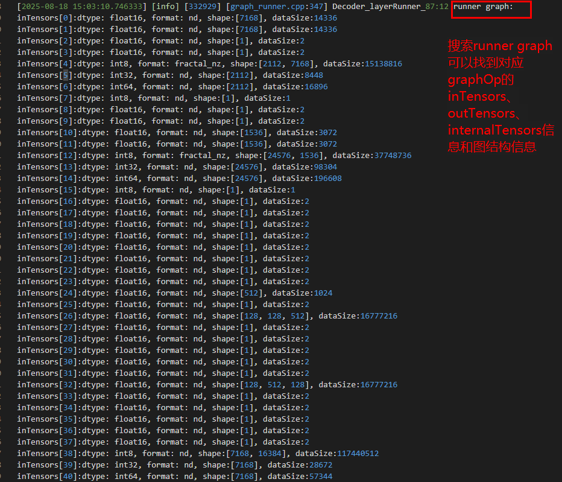

其中Decoder_layerRunner_87:12表示：第87层的Decoder_layerRunner的第12次执行。


如果想要知道该Decoder_layerRunner的第0个节点AttentionRunner的详细信息可以搜索: `AttentionRunner_87_0:12 runner graph`。其中AttentionRunner表示是这个节点的名字，87_0表示第87层的Decoder_layerRunner的第0个节点。

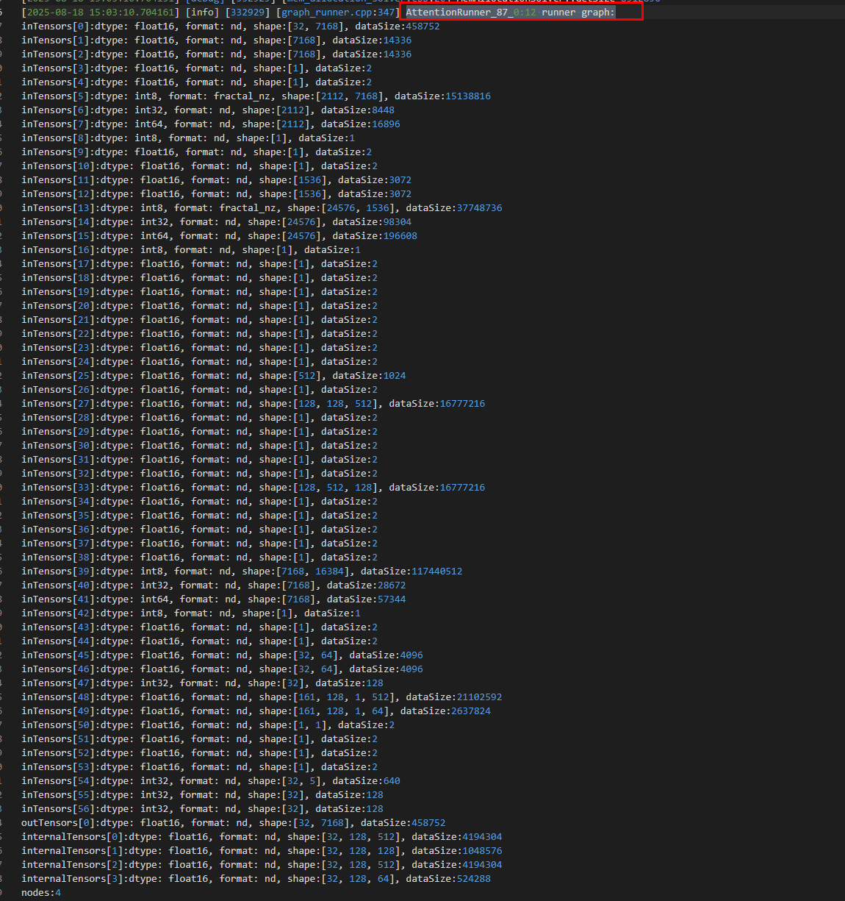

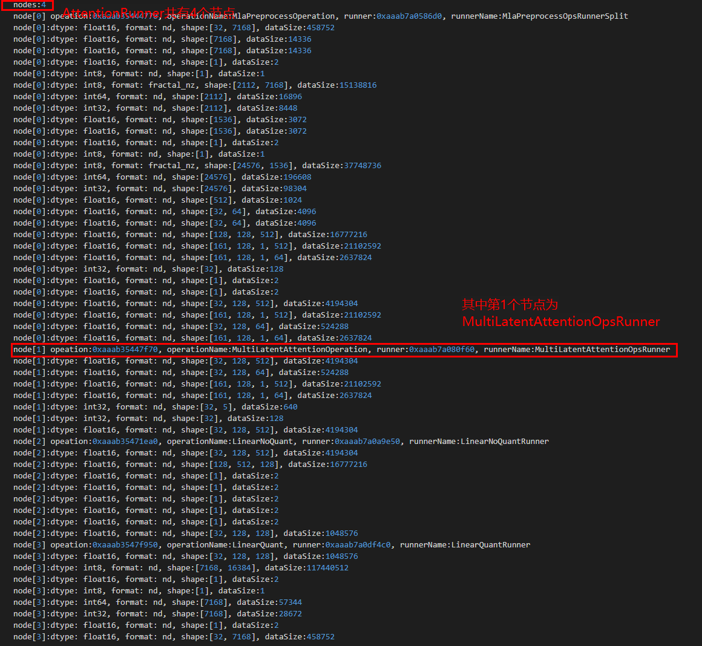

接下来如果想查看MultiLatentAttention算子实际运行时的param、inTensors、outTensors的内容可以搜索: `MultiLatentAttentionOpsRunner_87_0_1[0]` 找到`launchParam`关键字，其中和上面类似，87_0_1[0]表示：MultiLatentAttentionOpsRunner作为第87层的Decoder_layerRunner的第0个节点AttentionRunner的第1个节点的第0个算子。

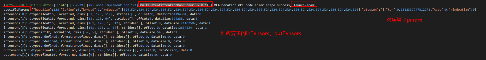


# ATB加速库调试相关环境变量

## 环境变量介绍

* `ATB_STREAM_SYNC_EVERY_OPERATION_ENABLE`: 用于问题定位，确定报错所在的Operation。当变量配置为1时，每个Operation的Execute结束时就做流同步(`aclrtSynchronizeStream`)。
* `ATB_STREAM_SYNC_EVERY_RUNNER_ENABLE`: 用于问题定位，确定报错所在的Runner。当变量配置为1时，每个Runner的Execute结束时就做流同步。
* `ATB_STREAM_SYNC_EVERY_KERNEL_ENABLE`: 用于问题定位，确定报错所在的算子kernel。当变量配置为1时，每个算子kernel的Execute结束时就做流同步。

## 使用示例

以通过msprof采集到的llama模型的Decoder_layer为例
* 当不开启环境变量时

   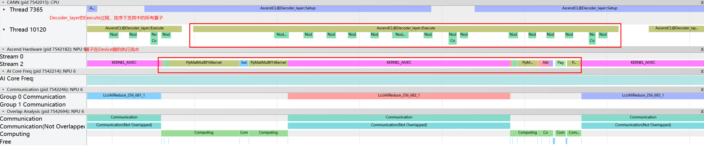
* 当开启环境变量`export ATB_STREAM_SYNC_EVERY_OPERATION_ENABLE=1`

   
* 当开启环境变量`export ATB_STREAM_SYNC_EVERY_RUNNER_ENABLE=1`

   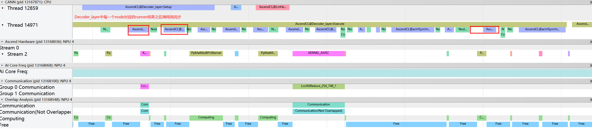
* 当开启环境变量`export ATB_STREAM_SYNC_EVERY_KERNEL_ENABLE=1`

   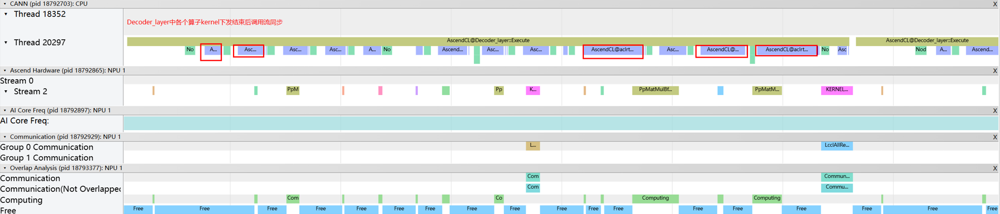

# 调试工具推荐

## 组图整网调试场景

本章节介绍使用ATB加速库图算子(Graph Operation)进行模型组图时常用的两个调试工具：msprof和msit dump，分别对应性能和精度两个不同的场景。

### 性能

想要了解使用ATB加速库组图中各个算子下发和运行的性能数据，可以通过msprof工具进行数据采集，并且通过`chrome://tracing`查看

1. 确认环境中有该工具
   
   首先需要查看环境是否安装CANN/ascend-toolkit并且配置好环境变量: `echo $ASCEND_HOME_PATH`。如果没有返回相应的路径，需要重新`source ${install_path}/set_env.sh`，其中${install_path}为CANN软件的安装目录。
2. 进行性能采集
   
   执行`msprof [options] --application=<app>`, 具体命令参数描述请查看：[MindStudio文档](https://www.hiascend.com/document/detail/zh/mindstudio/81RC1/T&ITools/Profiling/atlasprofiling_16_0008.html)
   
   * 以ATB加速库中的demo为例：`cd ${home_path}/example/op_demo/mla_preprocess && msprof --application="bash build.sh"`
3. 查看profiling性能数据
   
   进行性能数据采集之后，msprof工具会在所设置的output目录下生成相应的数据文件`mindstudio_profiler_output`目录，其中在此简单介绍两个最常用的文件：
   
   * `msprof_{timestamp}.json`: 可以通过`chrome://tracing`或`MindStudio Insight`打开查看组图中Host侧和Device侧的流水排布情况和算子执行耗时。
   * `op_summary_{timestamp}.csv`: 可以查看在执行组图时所用到的各个算子名、类型、输入输出tensor的信息、执行时间、cache命中情况等信息，可以用于分析性能数据，寻找优化点等。
4. 使用示例
   
    * `msprof --application="bash build.sh"`：运行mla_preprocess的用例
         
         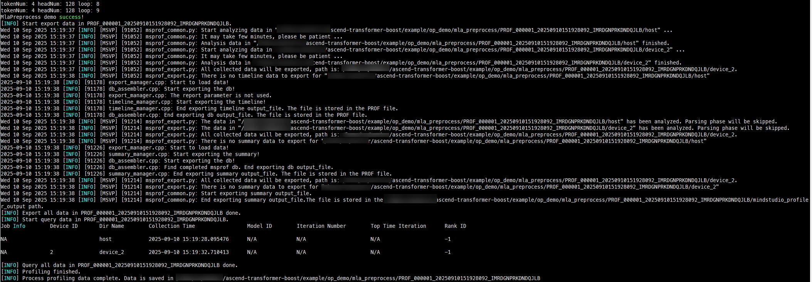

         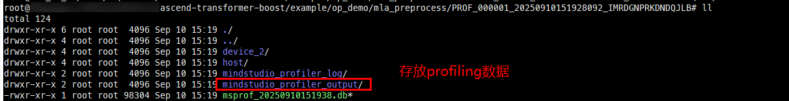
    * 查看性能数据：
         
         

        * profiling流水：
            通过`chrome://tracing`打开`msprof_{timestamp}.json`文件
            
            
        * 算子性能数据：

            

### 精度

当遇到整网精度问题时，想要定位精度问题是由哪个算子的精度出现了问题导致整网精度出问题时，可以使用msit dump工具将ATB加速库组图中各个算子在执行时的输入输出tensor、param数据dump下来从而进行单算子验证。

1. 确保环境中是否有该工具
   
   首先需要查看环境是否安装CANN/ascend-toolkit并且配置好环境变量: `echo $ASCEND_HOME_PATH`。如果没有返回相应的路径，需要重新`source ${install_path}/set_env.sh`，其中${install_path}为CANN软件的安装目录 (需要注意的是在CANN 8.2.RC2版本之前的CANN会在数据采集时会默认不采集第一次的数据)。
2. 进行数据采集
   
   执行`msit llm dump --exec <app> [可选参数]`, 具体命令参数描述请查看：[DUMP加速库数据使用说明](https://gitee.com/ascend/msit/blob/master/msit/docs/llm/%E5%B7%A5%E5%85%B7-DUMP%E5%8A%A0%E9%80%9F%E5%BA%93%E6%95%B0%E6%8D%AE%E4%BD%BF%E7%94%A8%E8%AF%B4%E6%98%8E.md)
   
   * 以ATB加速库中的demo为例：`cd ${home_path}/example/op_demo/mla_preprocess && msit llm dump --exec "bash build.sh" --type model tensor`
3. 查看数据内容
   
   * 对于采集的到的dump数据，其目录结构对应的就是ATB加速库组图结构，其中Operation名前面的序号表示模型对应的层数(如：`62_LmHead`: 表示第62层的LmHead)。再下层目录中储存的则是这一层中所用到的所有Operation，前面的序号代表先后顺序(如：`0_GatherOperation`: 表示这一层的第0个Op为GatehrOperation)。再下一层目录储存的则是Operation调用的算子Kernel，前面的序号代表先后顺序(如：`0_Gather16I64Kernel`: 表示这个Operation调用的第0个算子为Gather16I64Kernel)。
   * 对于各个目录中的before、after目录中存储的则是对应当前目录在组图执行之前的tensor数据和执行之后的tensor数据。before中的数据主要用于查看inTensors，after中的数据主要用于查看outTensors。其中的tensor数据可以通过msit工具提供的`read_bin_data`等方法读取其内容, 具体参考：[API-读取和保存接口](https://gitee.com/ascend/msit/blob/master/msit/docs/llm/API-%E8%AF%BB%E5%8F%96%E5%92%8C%E4%BF%9D%E5%AD%98%E6%8E%A5%E5%8F%A3.md)。
   * op_param.json中则存储的是当前Operation在组图执行时对应使用的param数据。
4. 使用示例
   
   * 运行一个topktoppSamplingOp（其中有多个node）的csv用例：
     
      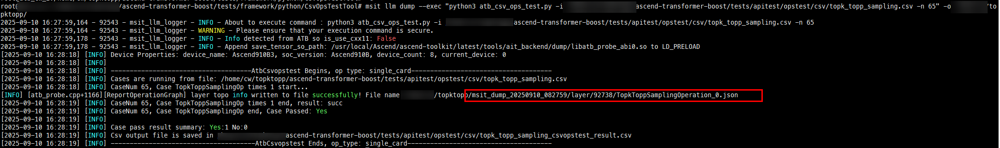
   * 查看dump tensor内容，其中前面的序号表示的是算子执行的顺序，如第一个算子为`TopKDescF16Kernel`、最后一个为`LogProbsSampleKernel`
     
      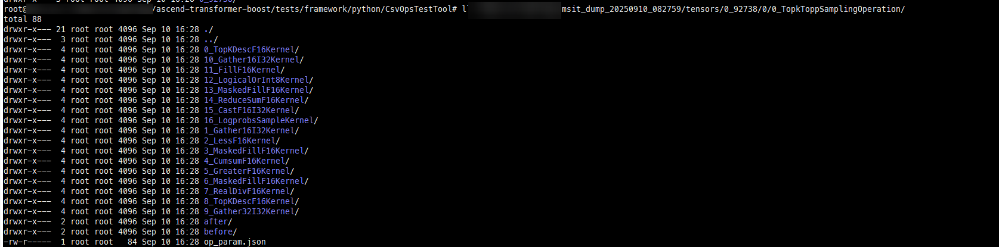
   * 以第一个算子TopkDescF16Kernel为例，`after目录`中存放的是`outTensors`、`before目录`中存放的是`inTensors`
     
      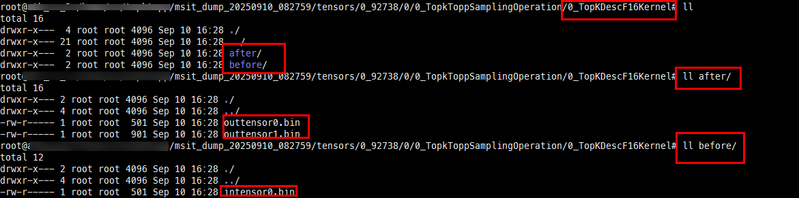
   * 读取tensor内容，以intensor0为例
     
      

## 单算子调试场景

本章节介绍ATB加速库单算子(Operation)的调试场景，适用于在ATB加速库中开发算子核函数(Kernel)代码时的调试。下文介绍两种调试功能MSDEBUG和AscendC_Dump。

### msDebug

`msDebug`允许用户对昇腾单算子程序设置断点、单步运行、查看核函数变量、NPU侧内存数据等能力，实现在同一个应用中同时调试CPU和NPU代码。就像`AscendC编程`是`C编程`的扩展一样，使用`msDebug`调试也是使用`gdb/lldb`调试的自然扩展。[官方文档](https://www.hiascend.com/document/detail/zh/CANNCommunityEdition/83RC1alpha001/devaids/optool/atlasopdev_16_0062.html)

1. 确认环境中是否有该功能
   
   若要使能msDebug工具，需要通过一下两种方式安装NPU驱动固件（CANN 8.1.RC1之后的版本且驱动为25.0.RC1之后的版本，推荐使用方法一）：

* 方法一：驱动安装时指定--full参数，然后再使用root用户执行echo 1 > /proc/debug_switch命令打开调试通道，msDebug工具便可正常使用。
  
  ```
  ./Ascend-hdk-<chip_type>-npu-driver_<version>_linux-<arch>.run --full
  ```
* 方法二：驱动安装时指定**--debug**参数，具体安装操作请参见[安装NPU驱动固件](https://www.hiascend.com/document/detail/zh/CANNCommunityEdition/83RC1alpha001/softwareinst/instg/instg_0005.html?Mode=PmIns&OS=Ubuntu&Software=cannToolKit)。
  
  ```
  ./Ascend-hdk-<chip_type>-npu-driver_<version>_linux-<arch>.run --debug
  ```

2. 进行带有该功能的ATB加速库编译
   
   在编译ATB加速库的时候添加编译选项: `--msdebug`。例如: `bash scripts/build.sh testframework --msdebug --no-pybind`
   如果出现以下类似报错，是因为开启--msdebug时需要使用-O0 -g编译算子，stack frame size超出限制。
   
   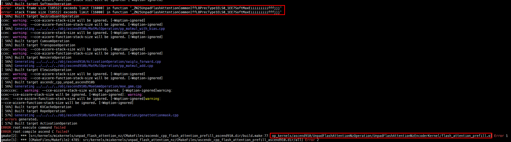
   此处报错为在编译ascend910中的UnpadFlashAttentionNzEncoderKernel时超出限制，如果不需要调试此算子可以通过删除源码目录中src/kernels/configs/mixkernels/op_list.yaml文件中对应的内容后再进行编译。如果是需要调试的算子，就需要修改算子代码减少堆栈。
   
   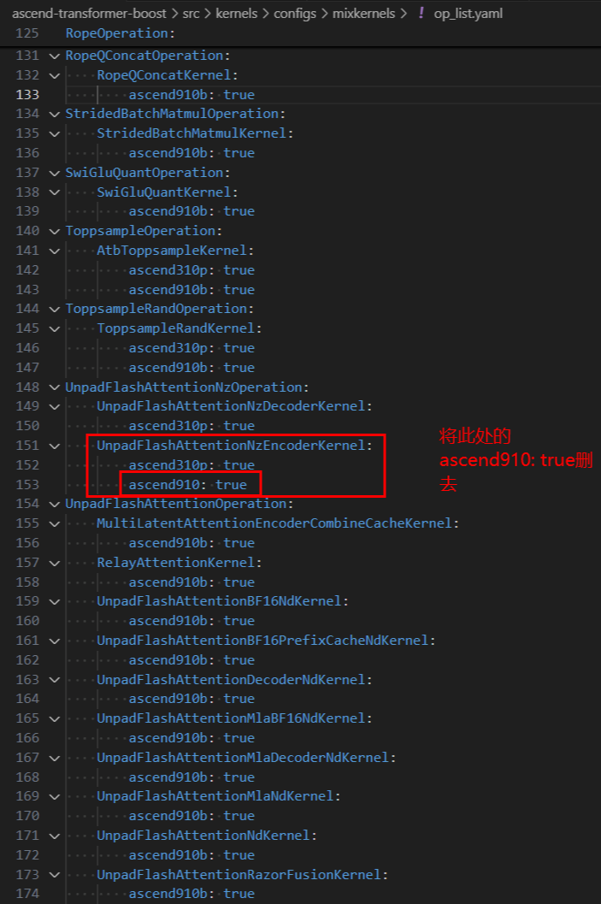
3. 设置环境变量
   
   * 编译完成之后设置环境变量`LAUNCH_KERNEL_PATH`去配置需要调试的算子.o文件。例如: `export LAUNCH_KERNEL_PATH={kernel.o}`(其中ATB加速库的算子kernel.o路径使用源码编译时会存在放在build/op_kernels/目录下)
   * 设置ATB加速库环境变量: `source output/atb/set_env.sh`

4. 调试算子
   
   * 调用对应算子`msdebug {可执行文件或程序}`，以ATB加速库中的测试脚本为例：`msdebug python3 test_faster_gelu.py`
   * 常用命令表
     
        | 命令                                       | 命令缩写                          | 作用                                                                                                                                              | 示例                                   |
        | ------------------------------------------ | --------------------------------- | ------------------------------------------------------------------------------------------------------------------------------------------------- | -------------------------------------- |
        | breakpoint filename:lineNo                 | b                                 | 增加断点                                                                                                                                          | b add\_custom.cpp:85<br>b my\_function |
        | run                                        | r                                 | 重新运行                                                                                                                                          | r                                      |
        | continue                                   | c                                 | 继续运行                                                                                                                                          | c                                      |
        | print                                      | p                                 | 打印变量                                                                                                                                          | p zLocal                               |
        | frame variable                             | var                               | 打印当前帧所有变量                                                                                                                                | var                                    |
        | memory read                                | x                                 | 读内存<br>-m 指定内存位置，支持GM/UB/L0A/L0B/L0C<br>-f 指定字节转换格式<br>-s 指定每行打印字节数<br>-c 指定打印的行数                   | x -m GM -f float16[] 1000-c 2 -s 128   |
        | register read                              | re r                              | 读取寄存器值<br>-a 读取所有寄存器值<br>\$REG\_NAME 读取指定名称的寄存器值                                                                         | register read -are r \$PC              |
        | thread step-over                           | next<br>n                         | 在同一个调用栈中，移动到下一个可执行的代码行                                                                                                      | n                                      |
        | ascend info devices                        | /                                 | 查询device信息                                                                                                                                    | ascend info devices                    |
        | ascend info cores                          | /                                 | 查询算子所运行的aicore相关信息                                                                                                                    | ascend info cores                      |
        | ascend info tasks                          | /                                 | 查询算子所运行的task相关信息                                                                                                                      | ascend info tasks                      |
        | ascend info stream                         | /                                 | 查询算子所运行的stream相关信息                                                                                                                    | ascend info stream                     |
        | ascend info blocks                         | /                                 | 查询算子所运行的block相关信息<br>可选参数： -d/–details显示所有blocks当前中断处代码                                                               | ascend info blocks                     |
        | ascend aic core                            | /                                 | 切换调试器所聚焦的cube核                                                                                                                          | ascend aic 1                           |
        | ascend aiv core                            | /                                 | 切换调试器所聚焦的vector核                                                                                                                        | ascend aiv 5                           |
        | target modules addkernel.o                 | image addkernel.o                 | PyTorch框架拉起算子时，导入算子调试信息 <br>（注：当程序执行run命令后再执行本命令导入调试信息，<br>则还需额外执行image load命令以使调试信息生效） | image addAddCustom\_xxx.o              |
        | target modules load –f kernel.o –s address | image load -f kernel.o -s address | 在程序运行后，使导入的调试信息生效                                                                                                                | image load -f AddCustom\_xxx.o -s 0    |
     
     
5. 使用示例
   
   * `export LAUNCH_KERNEL_PATH={kernel.o}` ：设置需要调试的算子
     
      
   * `msdebug python3 test_faster_gelu.py`：运行算子用例
     
      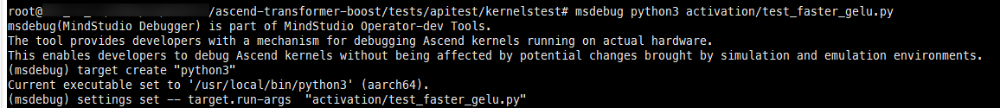
   * `b faster_gelu_forward.h:{row_num}`：设置断点并且运行
     
      
   * `p inputGM`：打印变量的内容
     
      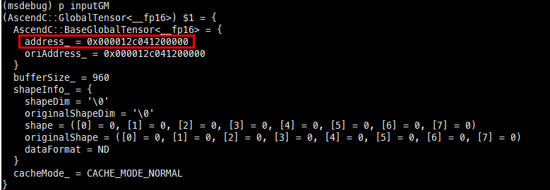
   * `x -m GM -f float16[] -c 1 -s 768 0x000012c041200000`：读取对应内存的内容
      

### AscendC_Dump

ATB加速库的`AscendC_Dump`功能支持用户在调试ATB加速库中的算子时，在核函数中添加AscendC::printf、AscendC::DumpTensor接口打印相应的值，方便用户进行调试定位。需要注意的是该功能为调试功能，开启后会对算子实际下发和运行带来一定影响，不推荐在模型场景下开启该功能。

1. 确认环境中有该工具
   
   首先需要查看环境是否安装CANN/ascend-toolkit并且配置好环境变量: `echo $ASCEND_HOME_PATH`。如果没有返回相应的路径，需要重新`source ${install_path}/set_env.sh`，其中${install_path}为CANN软件的安装目录。
2. 添加AscendC::printf、AscendC::DumpTensor到对应算子的核函数中。
   
   * AscendC::printf: 该接口提供CPU域/NPU域调试场景下的格式化输出功能。在算子kernel侧实现代码中需要输出日志信息的地方调用printf接口打印相关内容。[官方文档](https://www.hiascend.com/document/detail/zh/CANNCommunityEdition/83RC1alpha001/API/ascendcopapi/atlasascendc_api_07_0193.html)
     
     * 函数接口：`void AscendC::printf(__gm__ const char* fmt, Args&&... args)`
     * 参数说明:
        | 参数名 | 输入/输出 | 描述                                                                                                                                                                                                                                                                                                                                                                                                                                                                                |
        | ------ | --------- | ----------------------------------------------------------------------------------------------------------------------------------------------------------------------------------------------------------------------------------------------------------------------------------------------------------------------------------------------------------------------------------------------------------------------------------------------------------------------------------- |
        | fmt    | 输入      | 格式控制字符串，包含两种类型的对象：普通字符和转换说明。支持的转化类型：<br>%d/%i: 输出十进制整数，支持打印数据类型：bool、int8_t、int16_t、int32_t、int64_t <br>%f: 输出实数，支持打印数据类型：float/half/bfloat16_t <br>%x: 输出十六进制整数，支持打印的数据类型：int8_t、int16_t、int32_t、int64_t、uint8_t、uint16_t、uint32_t、uint64_t <br> %s: 输出字符串 <br> %u: 输出unsigned类型数据，支持打印的数据类型：bool、uint8_t、uint16_t、uint32_t、uint64_t <br>%p: 输出指针地址 |
        | args   | 输入      | 附加参数，个数和类型可变的参数列表：根据不同的fmt字符串，函数可能需要一系列的附加参数，每个参数包含了一个要被插入的值，替换了fmt参数中指定的每个%标签。参数的个数应与%标签的个数相同。                                                                                                                                                                                                                                                                                              |
            
       

   * AscendC::DumpTensor: 使用该接口Dump指定Tensor的内容, 目前只支持打印存储位置为Unified Buffer、L1 Buffer、L0C Buffer、Global Memory的Tensor信息。[官方文档](https://www.hiascend.com/document/detail/zh/CANNCommunityEdition/83RC1alpha001/API/ascendcopapi/atlasascendc_api_07_0192.html)
     * 函数接口:

         ```
         # 不带Tensor shape的打印
            template <typename T>
            __aicore__ inline void DumpTensor(const LocalTensor<T> &tensor, uint32_t desc, uint32_t dumpSize)
            template <typename T>
            __aicore__ inline void DumpTensor(const GlobalTensor<T>& tensor, uint32_t desc, uint32_t dumpSize)
         # 带Tensor shape的打印
            template <typename T>
            __aicore__ inline void DumpTensor(const LocalTensor<T>& tensor, uint32_t desc, uint32_t dumpSize, const ShapeInfo& shapeInfo)
            template <typename T>
            __aicore__ inline void DumpTensor(const GlobalTensor<T>& tensor, uint32_t desc, uint32_t dumpSize, const ShapeInfo& shapeInfo)
         ```

   * 参数说明：

       | 参数名    | 输入/输出 | 描述                                               |
       | --------- | --------- | -------------------------------------------------- |
       | tensor    | 输入      | 需要dump的Tensor                                   |
       | decs      | 输入      | 用户自定义的附加信息，用于区分Dump内容的来源       |
       | dumpSize  | 输入      | 需要dump的元素个数                                 |
       | shapeInfo | 输入      | 传入Tensor的shape信息时，可以按照shape信息进行打印 |

3. 进行带有该功能的ATB加速库编译，设置环境变量
   
   * 在编译ATB加速库的时候添加编译选项: `--ascendc_dump`，如果想直接使用ATB加速库中的算子测试用例(kerneltest目录下)需要搭配上testframework进行编译。例如: `bash scripts/build.sh testframework --ascendc_dump --no-pybind`
   * 设置环境变量: `source {CODE_PATH}/output/atb/set_env.sh`

4. 运行对应算子
   
   * 运行ATB加速库中的算子测试用例调用算子:
     * 移动到测试用例目录：`cd {CODE_PATH}/tests/apitest/kernelstest ` , 其中`{CODE_PATH}`为ATB加速库源码所在路径
     * 执行对应算子用例: `python3 {test_file}`, 其中mix算子的测试用例在mix文件夹下 (如gating算子：`python3 mix/test_gating.py`)
   * 运行ATB加速库中的op_demo调用算子:
     * 移动到demo目录：`cd {CODE_PATH}/example/op_demo`, 其中`{CODE_PATH}`为ATB加速库源码所在路径
     * 执行对应的Operation示例：`bash build.sh` (如mla_preprocess算子：`cd mla_preprocess && bash build.sh`)
5. 使用示例
   
   * 在faster_gelu_forward算子核函数中添加对应的打印内容：

      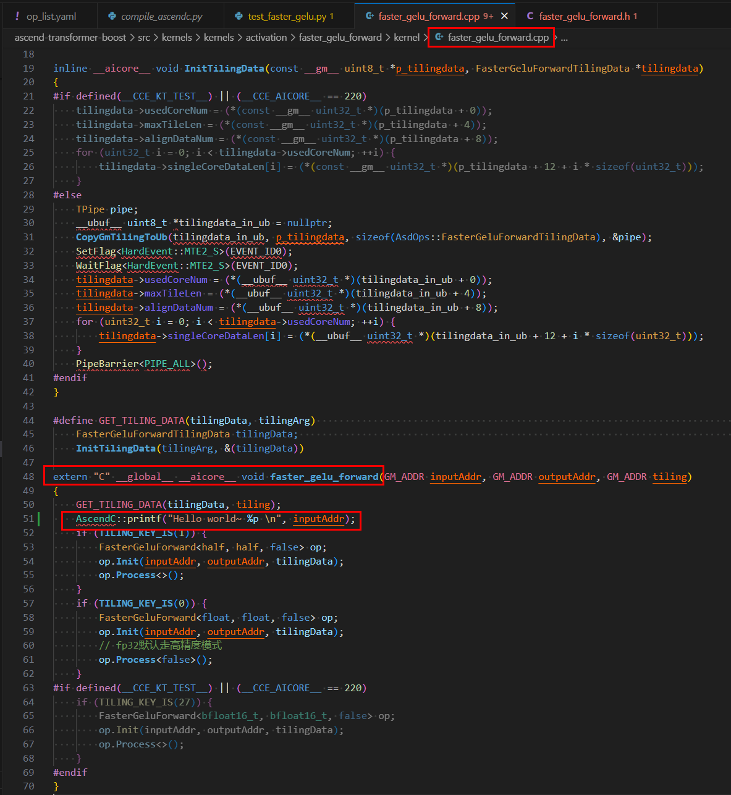
     
      
   * `bash scripts/build.sh testframework --ascendc_dump --no-pybind`：编译带有测试框架的ATB加速库源码
   * `source output/atb/set_env.sh`: 设置ATB加速库环境变量
   * `cd tests/apitest/kernelstest`: 移动到测试目录下
   * `python3 activation/test_faster_gelu.py`：运行faster_gelu_forward算子用例
      
  