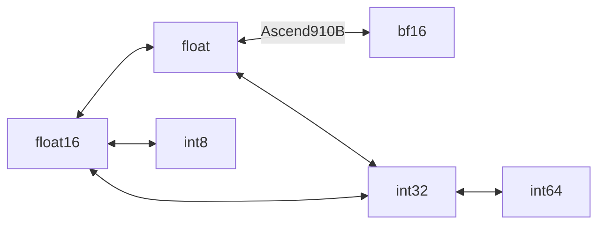

# Cast
## 参数说明
- **OpName**：ElewiseOperation
- **PARAM**
**Param Type**：OpParam::Elewise

| 名称          | 类型 | 描述                                 |
| ------------- | ---- | ------------------------------------ |
| elewiseType   | enum | ELEWISE_CAST                         |
| roundMode     | enum | 0:CAST_NONE,1:CAST_RINT,2:CAST_FLOOR |
| outTensorType | enum | 输出类型                             |
- **In/Out Tensor**

| 名称 | 类型 | dims                       | dtype      | format |
| ---- | ---- | -------------------------- | ---------- | ------ |
| x    | In   | [$d_0$, $d_1$, ..., $d_n$] | 参考对照表 | ND     |
| y    | Out  | [$d_0$, $d_1$, ..., $d_n$] | 参考对照表 | ND     |

## 功能描述
- 算子功能：转化数据类型。
- 计算公式：$y=cast(x)$

### 输入输出对照图

## 示例
```
输入：
	roundMode = 0
	outTensorType = TENSOR_DTYPE_FLOAT16
	
	x = [[[ 2.9198072, 1.0095004, 1.9171668, 2.8919375],
		  [1.81655222, 1.5375249, 2.5533924, 2.3707793]],
		 [[ 2.1447015, 2.2990177, 2.1887584, 2.0950549],
		  [  1.048348,  2.425626, 1.7851114, 1.2848076]]]

输出：
	y = [[[2.9199, 1.0098, 1.9170, 2.8926],
		  [1.8164, 1.5371, 2.5527, 2.3711]],
		 [[2.1445, 2.2988, 2.1895, 2.0957],
		  [1.0488, 2.4258, 1.7852, 1.2852]]]

```

## 支持芯片型号

| 芯片名称   | 约束               |
| ---------- | ------------------ |
| ascend910b | 无                 |
| ascend310p | 不支持bf16数据类型 |
